# ✨**MagicUser**✨ Theme


✨ **MagicUser** is a custom theme for Obsidian.md that provides a pleasant and focused note-taking experience, with light and dark themes for day and night use. 

With the **Style Settings** community plugin, customize a wide range of theme elements to suit your preferences and create a truly engaging and productive workspace.

## Installation

1. Open Obsidian **Settings** -> select **Appearance**

2. **Themes** -> click **Manage** -> search for **MagicUser**

3. Select the theme -> click **Install and use**

## Built-in Themes 


> No extra plugin required.

In order to activate the Translucent Dark and Translucent Light themes, turn on "**Translucent window**".

## Plugins Compatibility

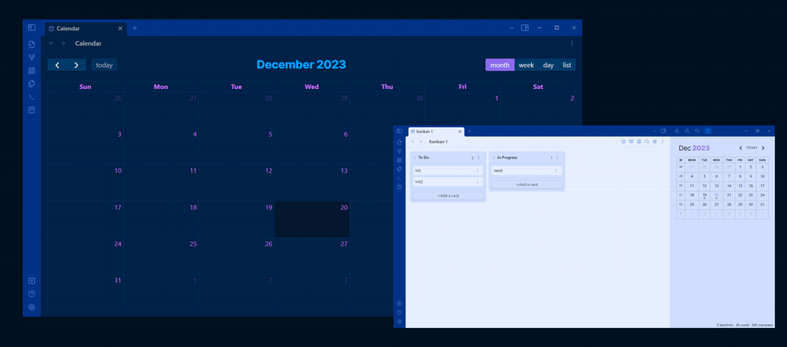

- Style Settings
- Dataview
- Kanban
- Calendar
- Full Calendar
- Tasks

## Style Settings - Theme Options


> [Style Settings](https://github.com/mgmeyers/obsidian-style-settings) Community Plugin required.

<details open="open">
<summary><b>Preset Themes</b> - <i>click to expand/collapse</i></summary>

1. **MagicUser** (Default)

2. **MagicUser Room Lamp**


3. **MagicUser Purple**


4. **MagicUser Teal**


5. **MagicUser Gray**
  


6. **MagicUser Camouflage**


7. **MagicUser Moon**


**MagicUser BG Series**

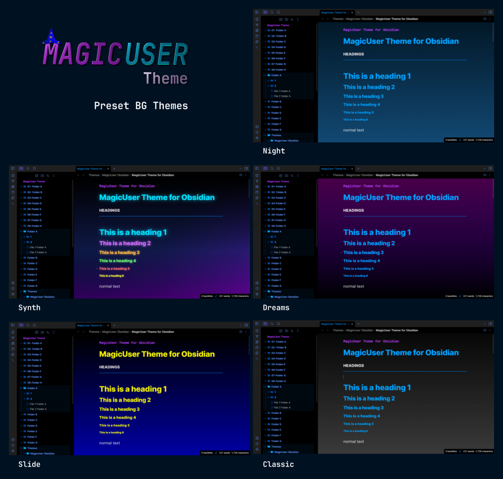

**MagicUser BG Series (Light Themes)**

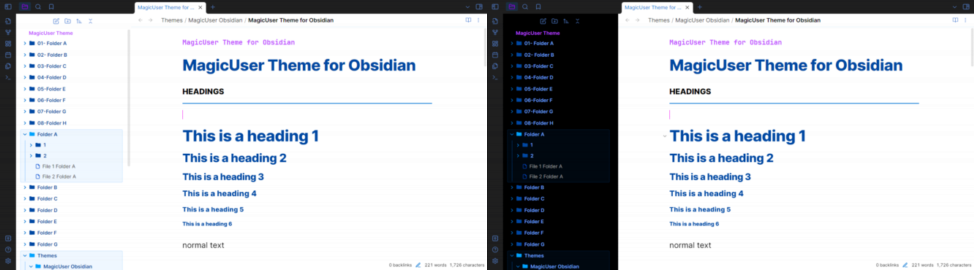

- **Darken background** slider (**all preset BG themes** - **dark mode**). You can darken the background of all preset BG themes to improve readability.

</details>

<details>
<summary><b>UI Settings</b> - <i>click to expand</i></summary>

Submenus:

◼ **Main Theme Colors**

- **Frame** color
- **Primary background** color
- **Secondary background** color
- **Caret** / **text cursor** color
- **Vault title** color
- **Inline title** color
- Stacked mode tabs: active tab **border width**
- Stacked mode tabs: active tab **border color**

◼ **Icons and Folders**

- **Folder name** color (light and dark modes)
- **Folder icon** color
- **File icon** color
- **Icon focused** color
- Show/hide **folder icons**
- Show/hide **file icons**

◼ **Indent Guides**

- Select 6 **indent guides colors** (independent colors for light and dark modes)

◼ **Line Highlight**

- Active **line highlight border** color (9 options)
- Active **line highlight background** color (9 options)

◼ **Reading Mode**

- **Reading indicator width** - slider controller
- **Reading indicator color**
- **H1-H6 label colors** (independent colors for light and dark modes)

◼ **UI Advanced Settings** (Desktop Version)


- Activate **distraction-free mode**
- **Compact command palette and prompts** (toggle)
- **Transparent menus** and **prompts** (toggle)
- **Transparency level adjustment** (slider).

**Hide UI Elements** Submenu:
- Hide **sidebar buttons** (new note, new folder and others)
- Show/hide **tab navigation back and forward buttons**
- Auto hide **title bar top left buttons**
- Auto hide **top side buttons**
- Auto hide **bottom side buttons**
- Auto hide **status bar**

> When **auto hide** is turned on, UI elements will gradually appear when you move your mouse over the area where they would normally be, and then gradually disappear when you move your mouse away.

</details>

<details>
<summary><b>Headings H1-H6</b> - <i>click to expand</i></summary>

- Headings **font** (H1 - H6)
- H1 to H6 **font size**
- H1 to H6 **color**

</details>

<details>
<summary><b>Text</b> - <i>click to expand</i></summary>

- **Bold text** color
- **Italic text** color
- **Highlighted text** color

</details>

<details>
<summary><b>Links</b> - <i>click to expand</i></summary>

- **Internal link decoration** (underline, none)
- Internal link **color**
- Internal link **hover color**
- **External link decoration** (underline, none)
- External link **color**
- External Link **hover color**

</details>

<details>
<summary><b>Checklist</b> - <i>click to expand</i></summary>

- Checklist done **decoration** (underline, line-through, none)
- Checklist done **text color**

</details>

<details>
<summary><b>Code</b> - <i>click to expand</i></summary>

- Code font
- Code background color
- Keyword
- String
- Number
- Comment
- Function
- Property
- Tag
- Attribute
- Operator
- Punctuation

</details>

## Rainbow Folders

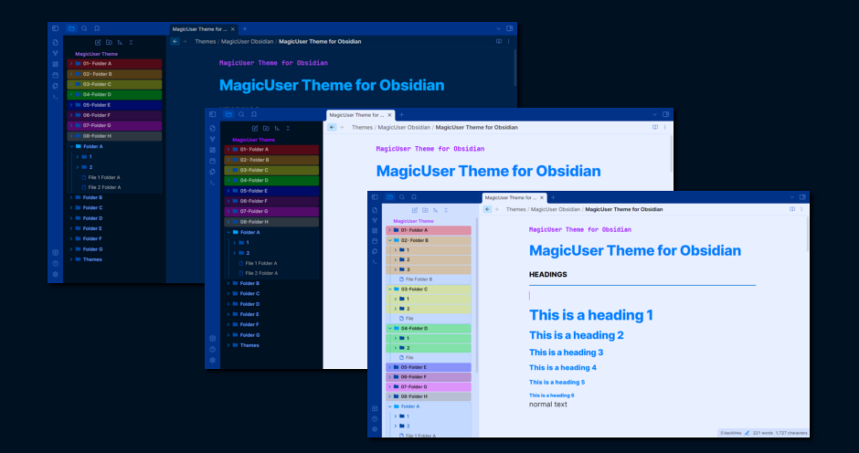

- When activated, this mode will highlight the background of folders starting with the numbers "01-" and/or "001-" to "08-" and/or "008" (according to the order of rainbow colors plus the gray color, 8th color). It will work with folders starting with "01 Folder name" to "08 Folder name".
- All **subfolders** will have the same color of the top folder.

**Folder name**:

`Number` + ` ` (space) and/or 
`Number` + `-` (hyphen or minus)

**Example**:
`01 Folder name` or `01-Folder name`

Activate this mode using the Style Settings plugin:
> **UI Settings** -> **Icons and Folders** -> Rainbow colored background folders 

## Dark Sidebar (Light Mode)

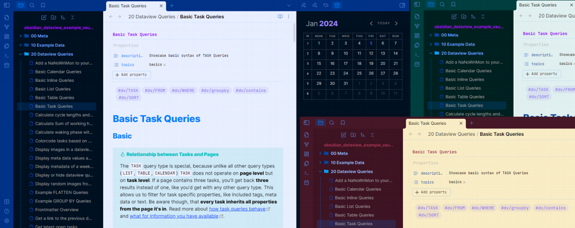

- Style Settings: Enable dark sidebar in light mode (compatible with preset themes)

> **Style Settings** -> **UI Settings** -> **Main Theme Colors** -> Dark sidebar (light mode)
 
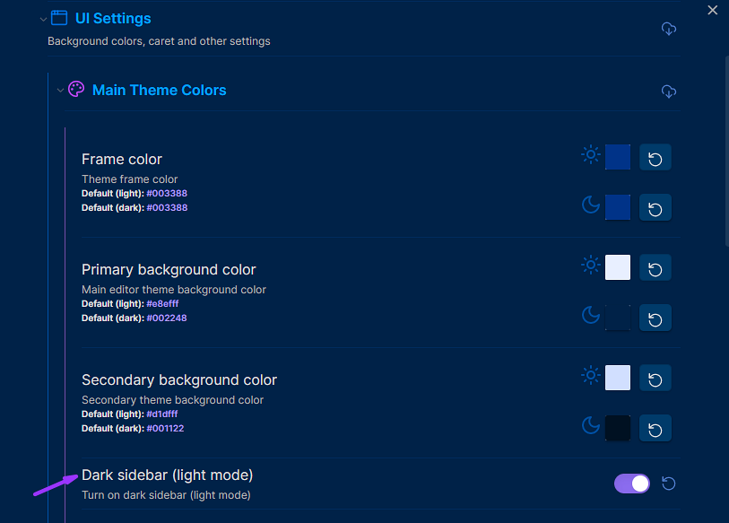

## Neon Mode

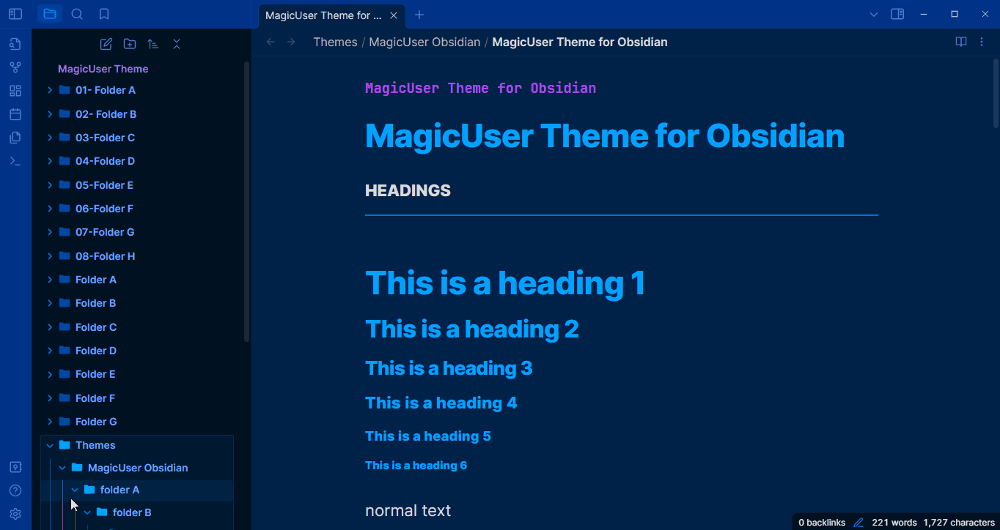

> **Style Settings** -> **Headings H1-H6** -> Neon mode

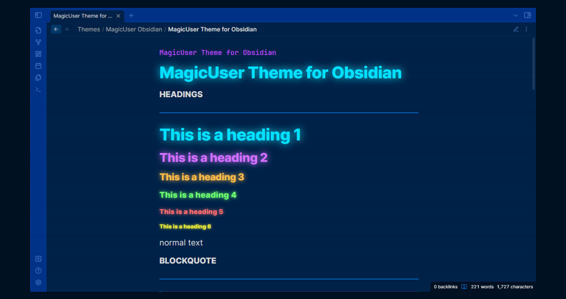

## Neon Mode Glow Controller

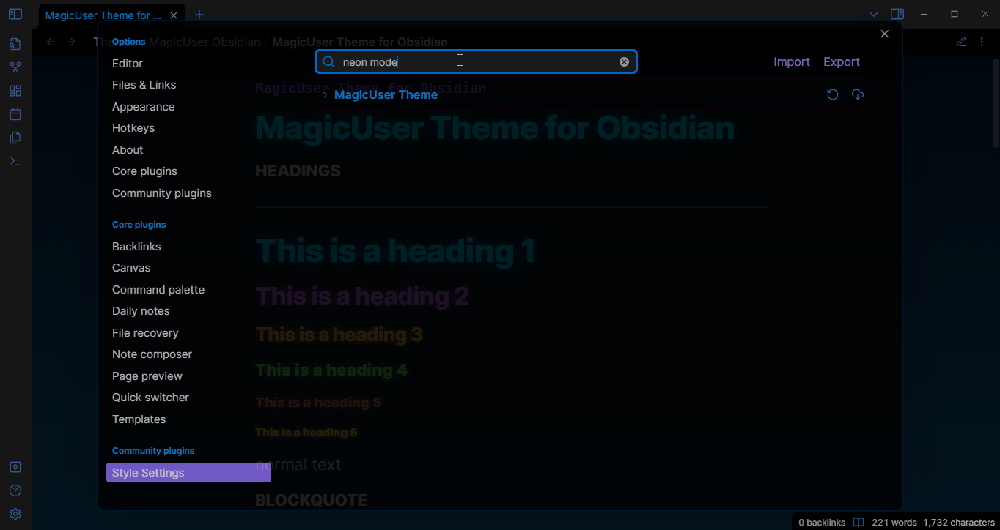

## Outline Neon Mode

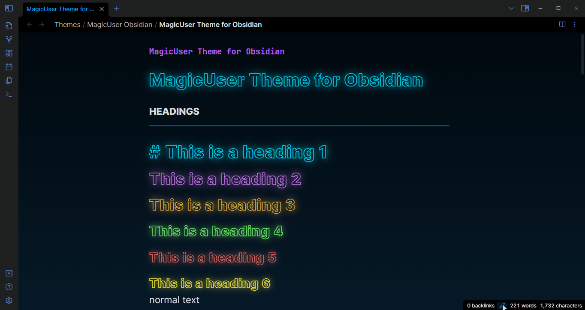

**Outline Neon** mode enlarges headings for effortless reading, all while keeping your text neon-highlighted. Choose your preferred style.

## Distraction-free Mode


To show the left ribbon, place your cursor on the left side of the screen, it will hide again when you move your cursor away from the left side of the screen.

- You can also auto hide the **status bar** (UI Advanced Settings).


## Reading Mode: Reading Glow Effect and Reading Indicator

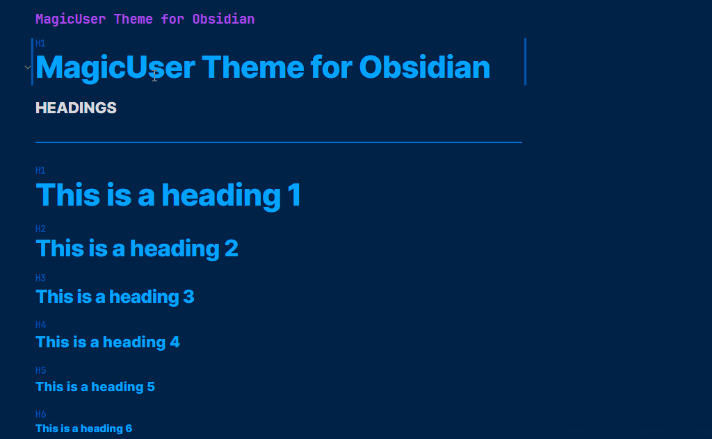

- Reading Mode: **Reading glow** effect.
- Style Settings: Reading glow **color** (7 colors).
- Style Settings: Reading glow border size.
- Style Settings: Reading glow corners size (0 = square corners).

## Dataview Tables to Cards

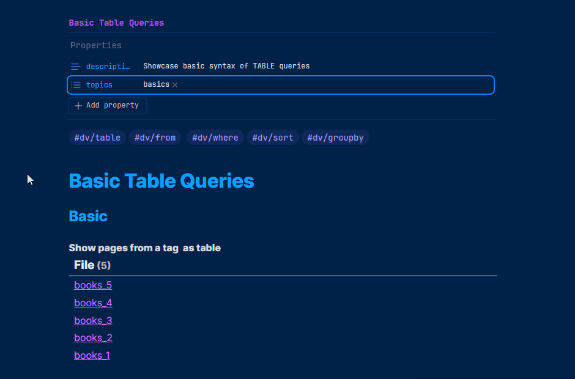

- **Dataview tables can be converted to cards**. Add cssclasses property (with `cards` class) on the note you want to transform the dataview tables to cards. This cards class was inspired by @kepano excellent Minimal theme, but it is a different code and look. I hope you also find it useful.

- The default `cards` class will add **3 columns** maximum. If you want just 2 columns add `cards cards2` (cssclasses property).

```frontmatter
---
# Display table to cards (2 columns)
cssclasses:
  - cards
  - cards2
---
```

- You can add **5 additional classes**: `cards1`, `cards2`, `cards3`, `cards4` and `cards5` (corresponding to the number of columns - 1 to 5 columns). I think this is easy to remember and implement.

```frontmatter
---
# Display table to cards (5 columns)
cssclasses:
  - cards
  - cards5
---
```

## Transparent Menus, Modals and Prompts


## Compact Prompts
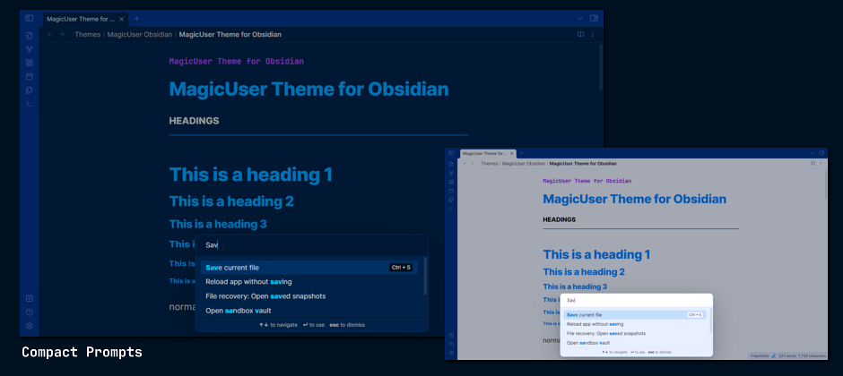

## Style Settings - Customize Colors for Light and Dark Modes


## Folder Icons, File Icons and Colored Indent Guides


You can customize the **indent guides colors** using the Style Settings plugin (independent colors for light and dark modes). You can also show/hide **folder icons** and **file icons**.

## Sidebar Open Folder Area

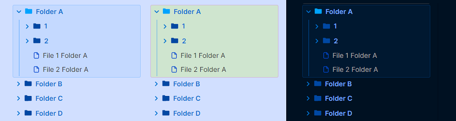

- Style Settings: select sidebar open folder area **border color**.
- Style Settings: select sidebar open folder area **background color**.
- Style Settings: **hide** sidebar open folder area.

## Custom Checkbox Icons


### Checkbox Icons (Extra 1)


### Checkbox Icons (Extra 2 and 3)


## Additional Callouts

### Media Callouts

`> [!m-` + `color] Callout Title`

*Colors*: white, black, gray


### Highlighter Callouts

`> [!hl-` + `color] Your Callout Title`

*Colors*: green, blue, orange, yellow, red, pink, purple


### Pen Callouts

`> [!p-` + `color] Your Callout Title`

*Colors*: green, blue, orange, yellow, red, pink, purple


### Quote Callouts

`> [!q-` + `color] Quote`

*Colors*: green, blue, orange, yellow, red, pink, purple


### Box Callouts

`> [!b-` + `color] Your Callout Title`

*Colors*: green, blue, orange, yellow, red, pink, purple


### Callout Headings (H1 - H6)

`> [!h1 to h6-` + `color] Your Title`

*Colors*: green, blue, orange, yellow, red, pink, purple


### Specific Callouts


`> [!video]`

`> [!mic]`

`> [!clip]` or `> [!paperclip]`

`> [!book]`

`> [!comment]`

`> [!target]`

`> [!pro]` or `> [!pros]`

`> [!con]` or `> [!cons]`

`> [!link]` or `> [!links]`

`> [!magic]`

## Caret Colors for Improved Visibility


## Caret Width (Selection and Multiple Cursors)


- When selecting text, the main edit cursor/caret will have a **different width** for better visibility (**no blinking caret**).
  
- Additional carets/cursors have a different width and no blinking carets (solid appearance).

## Search Highlight and Text Highlight


- **Global search highlight**, **linked mentions** and **outline text highlight**. 
- The search result text in **live preview**, **source** and **reading** modes will appear in black text color with highlighted background (default is **yellow**, but you can select any highlight color using the Style Settings). In **live preview** and **source** modes, the text will also appear **underlined** to be easier to find. It works for all types of text (normal text, bold, italic, links, tags, code and headings).

> Note: The underline will be the same color of your text cursor/caret color.

- **Outline highlight**: When you click on the item (using the outline) it will highlight the text the same way (search). I think it will be easier to read, especially when using different colors for H1-H6 titles (normal mode and neon mode).

## Search Highlight in Current Note


## Metadata highlighting


## Properties Layout


## Tables Layout


## Code Theme (Light and Dark)


The syntax highlighting in this theme is similar to the MagicUser themes for VS Code (MagicUser and MagicUser Light Blue).

## Footnotes
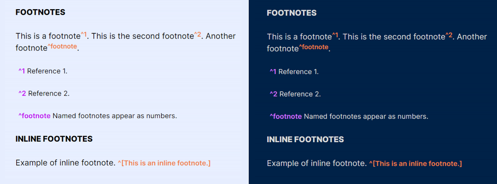

- You can customize the color of the footnotes (Style Settings). The default color is orange (light/dark modes).

## Mermaid

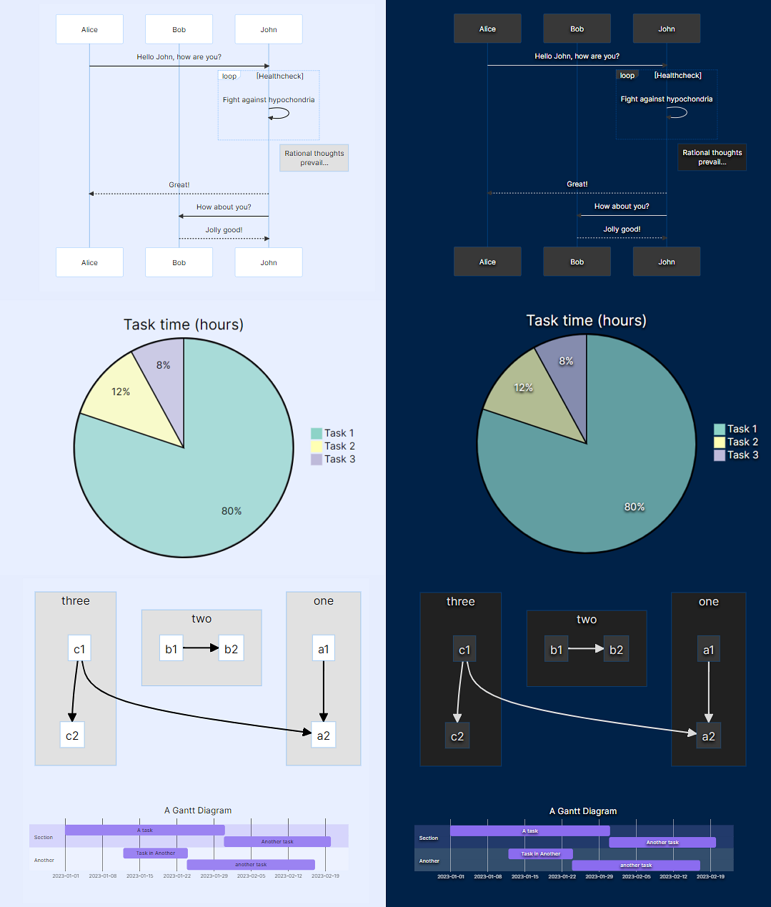

## Math
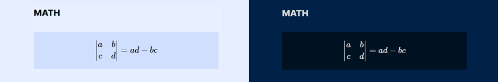

## Mobile Display


## Feedback and Support

✨ Spot a bug, have a suggestion? Share it on GitHub! Every voice shapes the future of this theme. Support the theme by starring its repository. It's free and simple, your star fuels growth and new features.

## License and Acknowledgements

MagicUser Theme for Obsidian

MIT License ⓒ Bernardo Pires

Most of the icons for the checkboxes and the quote icon were created by me (MIT License). You can find the comment in the embedded SVGs.

The icons used by the file icon, other callouts and some checkboxes icons are from [Lucide](https://lucide.dev/) Icons used by Obsidian. The Lucide icon library is licensed under the ISC License.

Some checkbox icons were inspired by the excellent Minimal Theme by Stephan Ango (@kepano) and the Things Theme by Colin Eckert (@colineckert). You can find more information about @kepano and @colineckert below, please check their themes and support their work:

- [Minimal Theme by Stephan Ango](https://github.com/kepano/obsidian-minimal)

- [Things Theme by Colin Eckert](https://github.com/colineckert/obsidian-things)


**Style Settings Community Plugin**

- Thanks to Matthew Meyers (@mgmeyers) for the amazing [Style Settings](https://github.com/mgmeyers/obsidian-style-settings) Plugin. Excellent work.


**Thanks for the Suggestions**
- @alitekdemir - suggestion to add the extra checkboxes (extra 1 - screenshot), based on Minimal and Things Themes. I hope you also find them useful.
- @YannMiro - suggestion to show/hide file icons.
- @zhouxinghong - reading mode suggestions (display H1-H6 labels on hover, colored H1-H6 labels) and colored indent guides in file explorer.
- @ll14m4n (Obsidian Forum) - dataview tables and stacked mode suggestions.

Special congratulations to the Obsidian.md team for creating a great software application.
