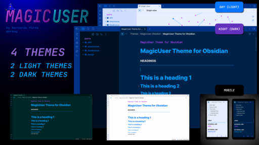

# ✨**MagicUser**✨ Theme

</img>

</img>

Version: 1.0.0

 

✨ **MagicUser** is a custom theme for Obsidian.md aiming to create a pleasant environment for note-taking activities with greater focus and concentration. It has light theme and dark theme for day/night use.

I hope this theme helps to increase your productivity and inspiration.

Thanks for using it 👍

Special congratulations to the Obsidian.md team for creating a great software application.

# Installation

- Open Obsidian **Settings** -> select **Appearance**

- Search for "**MagicUser**"

- Select the theme and click "**Install and use**"

# Feedback
If you have any issues and/or suggestions, please submit an issue. I will try to answer as soon as possible. Thanks.

# Disclaimer

This theme was tested on Windows computer. Hopefully it will work well on other platforms. If you encounter an issue, please let me know.