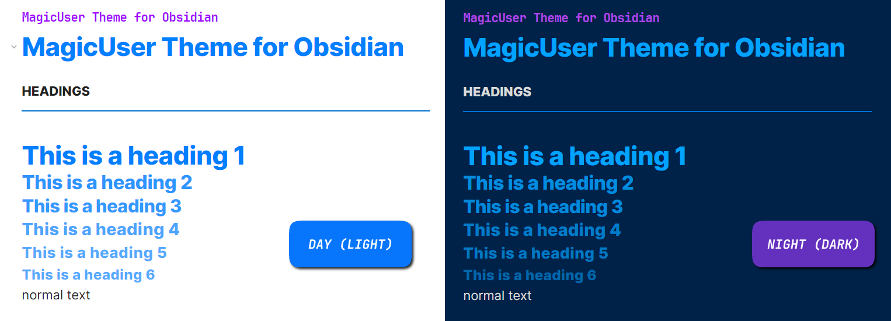
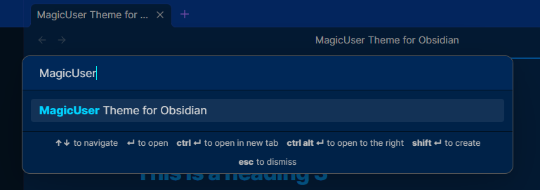
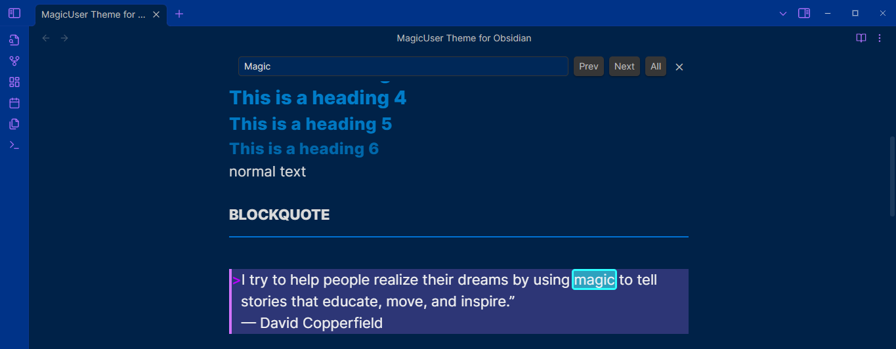
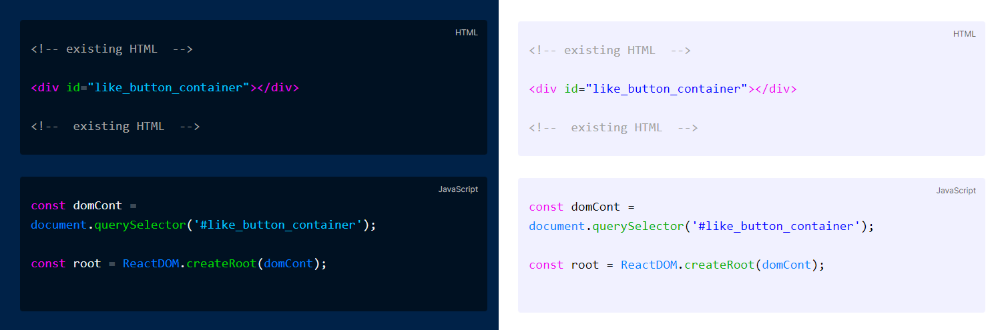
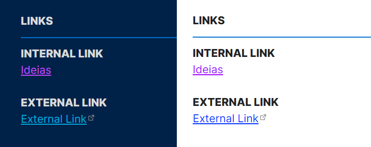

# ✨**MagicUser**✨ Theme

✨ **MagicUser** is a custom theme for Obsidian.md aiming to create a pleasant environment for note-taking activities with greater focus and concentration. It has **light theme** and **dark theme** for day/night use.

I hope this theme helps to increase your productivity and inspiration.

Thanks for using it 👍.

Special congratulations to the Obsidian.md team for creating a great software application.

# Installation

- Open Obsidian **Settings** -> select **Appearance**

- Search for **MagicUser**

- Select the theme and click **Install and use**

# Light and Dark Modes

# Caret Colors for Improved Visibility

# Search Highlight in Current Note

# Code Theme (Light and Dark)

# Links in Different Colors

# Feedback
  
If you have any issues and/or suggestions, please submit an issue. I will try to answer as soon as possible. Thanks.

