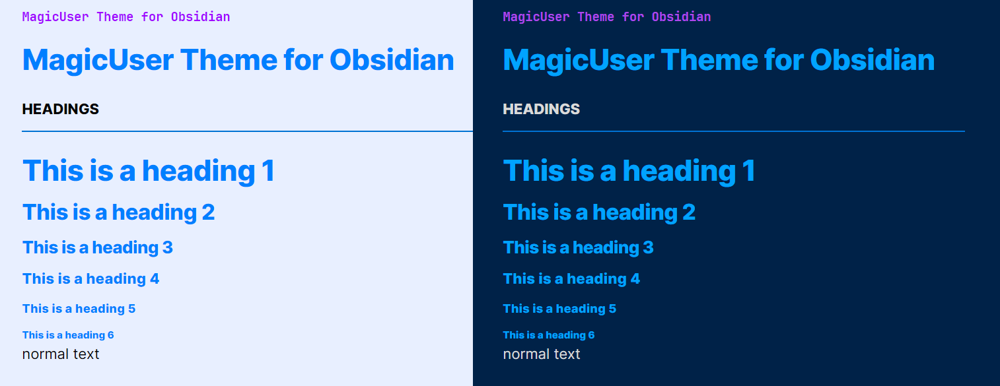
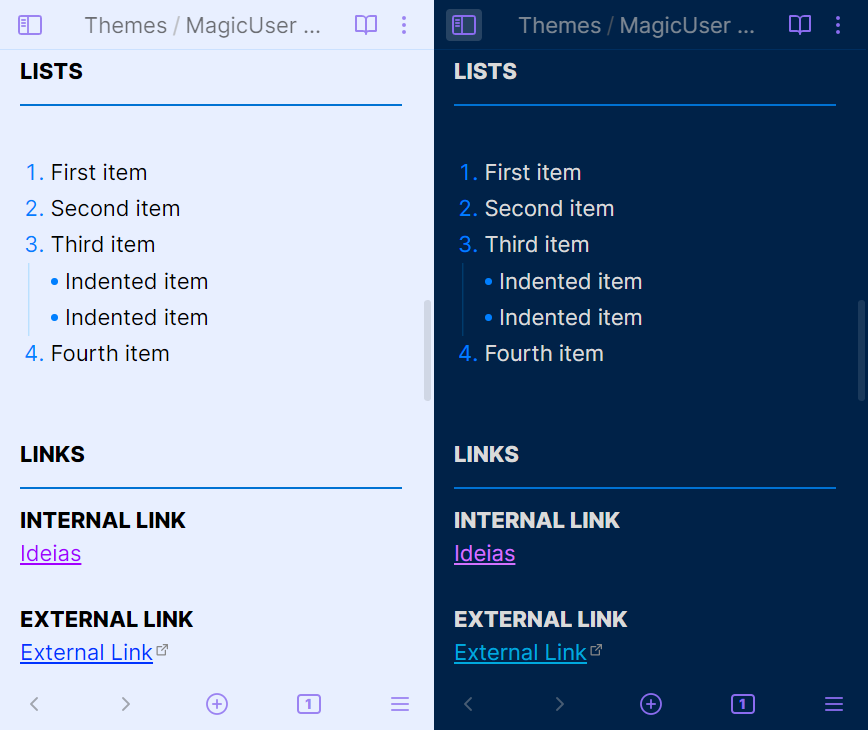

# ✨**MagicUser**✨ Theme


✨ **MagicUser** is a custom theme for Obsidian.md aiming to create a pleasant environment for note-taking activities with greater focus and concentration. It has **light theme** and **dark theme** for day/night use.

I hope this theme helps to increase your productivity and inspiration.

## Installation

1. Open Obsidian **Settings** -> select **Appearance**

2. **Themes** -> click **Manage** -> search for **MagicUser**

3. Select the theme -> click **Install and use**

## Custom Checkbox Icons


## Additional Callouts


### Highlighter Callouts

`> [!hl-` + `color] Your Callout Title`

**Colors**: green, blue, orange, yellow, red, pink, purple

**Example**: *highlighter green callout*
```
> [!hl-green] Your callout title here
> Callout text here

```

### Pen Callouts

`> [!p-` + `color] Your Callout Title`

**Colors**: green, blue, orange, yellow, red, pink, purple

**Example**: *pen blue callout*
```
> [!p-blue] Your callout title here
> Callout text here

```

### Quote Callouts

`> [!q-` + `color] Quote`

**Colors**: green, blue, orange, yellow, red, pink, purple

**Example**: *Quote green callout*
```
> [!q-green] Quote
> Quote author or comment

```

### Specific Callouts

`> [!video]`

`> [!mic]`

`> [!clip]` or `> [!paperclip]`

`> [!book]`

`> [!comment]`

`> [!target]`

`> [!pro]` or `> [!pros]`

`> [!con]` or `> [!cons]`

`> [!link]` or `> [!links]`

`> [!magic]`

**Example**: *magic callout*
```
> [!magic] Special Tip
> Callout text here

```
 
## Folders and Notes Icons


## Light and Dark Modes




## Caret Colors for Improved Visibility


## Caret Width (Selection and Multiple Cursors)


- When selecting text, the main edit cursor/caret will have a **different width** for better visibility (**no blinking caret**).
- Additional carets/cursors have a different width and no blinking carets (solid appearance).

## Search Highlight in Current Note


## Tables Layout


```Markdown
| Column 1  | Column 2 |  Column 3 |
| :---:     | :---:    |  :---:    |
| Text 1    | Text 2   | Text 3    |
| Text 4    | Text 5   | Text 6    |
| Text 7    | Text 8   | Text 9    |
| Text 10   | Text 11  | Text 12   |

```
**Left-align** a column: 
- Add a colon to the **left** of the hyphens `:---`

**Right-align** a column: 
- Add a colon to the **right** of the hyphens `---:` 

**Center-align** a column:
- Surround the hyphens with **colons** `:---:`

```Markdown
| Column 1  | Column 2 |  Column 3 |
| :---      | :---:    |  ---:     |
| Text 1    | Text 2   | Text 3    |
| Text 4    | Text 5   | Text 6    |

```
## Code Theme (Light and Dark)


## Mobile Display



## Feedback
  
If you have any issues and/or suggestions, please submit an issue. I will try to answer as soon as possible. Thanks.

## License and Acknowledgements

MagicUser Theme for Obsidian

MIT License ⓒ Bernardo Pires

Special congratulations to the Obsidian.md team for creating a great software application.
