# ✨**MagicUser**✨ Theme


✨ **MagicUser** is a custom theme for Obsidian.md that provides a pleasant and focused note-taking experience, with light and dark themes for day and night use. 

With the **Style Settings** community plugin, customize a wide range of theme elements to suit your preferences and create a truly engaging and productive workspace.


## Installation

1. Open Obsidian **Settings** -> select **Appearance**

2. **Themes** -> click **Manage** -> search for **MagicUser**

3. Select the theme -> click **Install and use**

## Built-in Themes 


> No extra plugin required.

## Style Settings - Theme Options

> [Style Settings](https://github.com/mgmeyers/obsidian-style-settings) community plugin required.


## Preset Themes

1. **MagicUser** (Default)

2. **MagicUser Room Lamp**


3. **MagicUser Purple**


4. **MagicUser Teal**


5. **MagicUser Gray**
  


6. **MagicUser Camouflage**


7. **MagicUser Moon**


8. **MagicUser Teacher**


9. **MagicUser Creativity**


10. **MagicUser Concentration**


11. **MagicUser Stealth**


### **MagicUser BG Themes**


**MagicUser BG Themes (Light Themes)**

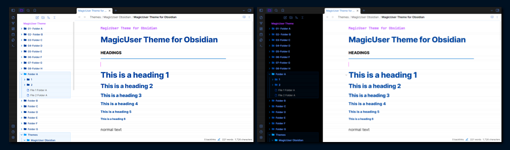

- **Darken background** slider (**all preset BG themes** - **dark mode**). You can darken the background of all preset BG themes to improve readability.

### MagicUser Chroma Amulet Theme


The **Chroma Amulet** preset is a special preset that you can use to create multiple color themes.

How it Works:

1. Select "**MagicUser Chroma Amulet**" preset.
2. Select theme color using the first slider: **color**.
3. Adjust the level of **saturation** using the second slider (turn this one closer to zero to greyish tones).

Quick and User-Friendly: The Chroma Amulet preset theme streamlines the theme personalization process, allowing you to create your favorite theme workspace colors effortlessly (using 1 or 2 sliders).

- **Automatic adjustment**: The Chroma Amulet preset automatically changes the color of various interface elements. This includes:
  - Icons,
  - Vault name,
  - Inline title,
  - Code punctuation,
  - Sidebars and other UI elements.

> MagicUser Chroma Amulet theme **does not affect your accent color**. So you can still use your favorite accent color with your chosen theme colors.

### MagicUser Accent Theme


The **MagicUser Accent** theme is also a special preset that you can use to create multiple color themes.

How it Works:

1. Select "**MagicUser Accent**" preset.
2. Select **accent color**  (Obsidian -> accent color picker).

> The theme will adjust according to the selected accent color (headings, icons, borders, blockquote border, lists and other UI elements).


## Automatic Rainbow Folders


- **Automatic Rainbow Colored Folders.** You can activate/deactivate this feature using the Command Palette.

## Automatic Rainbow-Colored Folder Names and Icons


- **Automatic Rainbow-Colored Folder Names and Icons.** Folder and subfolder names and icons will be colored (no background color change). You can also toggle this feature (activate/deactivate) using the Command Palette.

### Initial Color for Automatic Rainbow Folders (Slider)

- This feature allows you to set the starting color for the automatic rainbow color scheme applied to your folders and subfolders. This means you can determine the color assigned to the first folder in a hierarchy, and subsequent folders will follow the rainbow spectrum from that point.

## Numbered Rainbow Folders

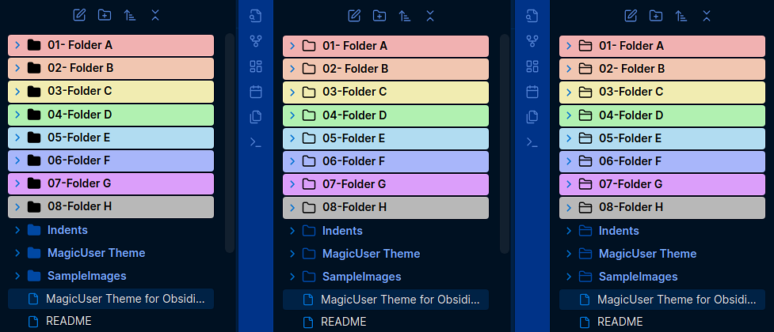

- When activated, this mode will highlight the background of folders starting with the numbers "01" and/or "001" to "08" and/or "008" (according to the order of rainbow colors plus the gray color, 8th color). It will work with folders starting with "01 Folder name" to "08 Folder name".
- All **subfolders** will have the same color of the top folder.

Activate this mode using the Style Settings plugin:
> **User Interface** -> **Icons, Folders and Sidebars** -> Numbered rainbow colored folders

## Select Folder Icons (3 Styles)


- **Folder Icon Styles:** You can select from 3 different folder styles for open and closed states (in Style Settings).

- **Folder and File Colors:**
    - You can select colors more intuitively using color pickers.
    - You can select specific colors for **closed folders**, **open folders**, and **files** (for both light and dark modes).

- You can also show/hide **folder icons** and **file icons**.

## Cards UI


Style Settings:
> **Preset Themes** -> Cards UI

## Outline UI - Sidebars and Active Icons


- Outline UI - sidebars
- Outline UI - active icons and elements
- Outline UI - select border color (light/dark modes)

Style Settings:
> **Preset Themes** -> Outline UI

## Tabs


**Style Settings** (**Tabs Submenu**)

- Select active tab **foreground color** (text and icon color).
- Select the **style of the tabs** (*3 options*): **default tabs**, **square tabs** and **pill tabs**.
- *Default tabs* mode: Select active tab **border color**.
- *Default tabs* mode: Select active tab **border width** (0 = no border).
- *Stacked tabs* mode: Select active tab **border color**.
- *Stacked tabs* mode: Select active tab **border width** (0 = no border).

## Breadcrumb

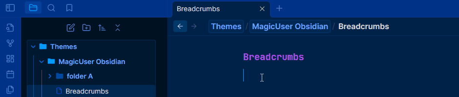

- New **breadcrumb layout** (view header breadcrumb). The breadcrumb folders will have the same border and background colors of the **sidebar open folder area** (file explorer). 

- You can also have an additional layout (**Slanted breadcrumb** - without the `/` separator and more compact. You can activate the **slanted breadcrumb** layout using Style Settings.

Style Settings:

> **User Interface** -> **Icons, Folders and Sidebars** -> **Breadcrumb** submenu -> Slanted breadcrumb layout

## MagicUser laser


Enhance your reading experience with personalized reading focus and comfort.
- MagicUser laser will be displayed in live preview, source and reading modes.

Style Settings:
> **User Interface** -> **Laser** -> MagicUser laser

### **Laser - Style Settings Options**

- Select **laser focus type** (**Line** or **Area**)
- Select **laser color** (**7 colors** - blue, green, red, orange, yellow, pink and purple)
- Select **laser intensity**.
- Select **laser area size** (slider).
- Select **laser position** (vertical position). Easily choose where you want the laser to highlight text on the screen. Whether you prefer to start at the top, center, or bottom, simply select your preferred reading position. The default position is in the center of the screen.

## Reading Mode: Reading Glow Effect and Reading Indicator

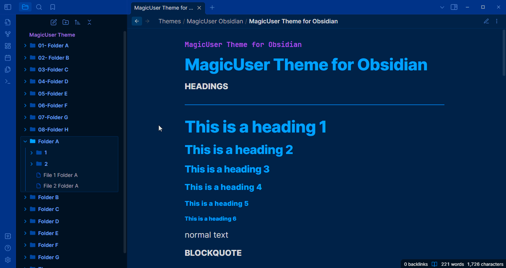

- Reading Mode: **Reading glow** effect.
- Style Settings: Reading glow **color** (7 colors).
- Style Settings: Reading glow border size.
- Style Settings: Reading glow corners size (0 = square corners).

## Active Line Zoom


This feature dynamically **adjusts the font size** of the current line for enhanced focus while typing or reading.
- **Live preview and source modes**: The font size of the line containing the cursor is temporarily magnified.
- **Reading mode**: Clicking on a line in reading mode activates a temporary zoom effect.
- **Active line zoom** can be toggled on or off via a shortcut key or the Command Palette.

Style Settings:
> **User Interface** -> **Line Highlight** -> Active line zoom

## Hover Underline


**Hover underline** (live preview, source and reading modes).
- **Toggle hover underline** (shortcut and/or Command Palette).

Style Settings:
> **User Interface** -> **Line Highlight** -> **Hover underline** submenu

**Hover underline submenu**.
- Select hover underline **style** (*default*, *dashed*, *dotted*,*double*).
- Select hover underline **color** (independent color for light/dark mode).
- Select hover underline **thickness** (slider).
- Select the **gap between text and hover underline** (slider).
  

## Colored Indent Guides

You can customize the **indent guides colors** using the Style Settings plugin (independent colors for light and dark modes).

## Sidebar Open Folder Area


- Style Settings: select sidebar open folder area **border color**.
- Style Settings: select sidebar open folder area **background color**.
- Style Settings: **hide** sidebar open folder area.
  
## Dark Sidebar (Light Mode)


- Style Settings: Enable dark sidebar in light mode (compatible with preset themes)

Style Settings:

> **User Interface** -> **Icons, Folders and Sidebars** -> **Sidebars** submenu -> Dark sidebar (light mode)
 
## Neon Mode


Style Settings:

> **Headings H1-H6** -> Neon mode


## Neon Mode Custom Headings Colors

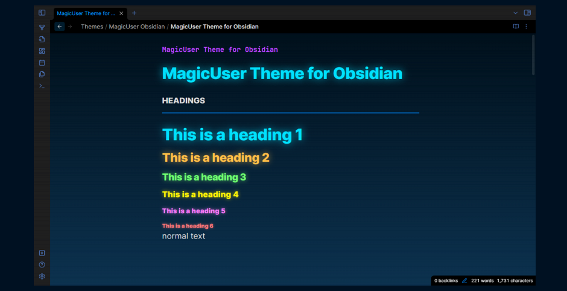

You can customize the neon mode headings colors using the **Neon Mode Headings** submenu.

Style Settings:

> **Headings H1-H6** -> **Neon Mode Headings**

## Neon Mode Glow Controller


## Outline Neon Mode


**Outline Neon** mode enlarges headings for effortless reading, all while keeping your text neon-highlighted. Choose your preferred style.

## Underline Headings


- Normal mode
- Neon mode
- Outline neon mode

You can toggle **underline headings** using a shortcut or the Command Palette.

Style Settings:

> **Headings H1-H6** -> Underline headings

## Blockquote Indent Indicator


## Tags Customization - Colored Tags


**Tags submenu** (Style Settings)
- Turn on **colored tags** (44 preset tags)
- **Tags shape** (0 = square tags)
- **Spacing** between the text and the hashtag (#) - slider controller
- **Hide hashtags** (#)
- Tags **text foreground** color
- Tags **text foreground hover** color
- Tags **background** color
- Tags **background hover** color
- Tags **border** color
- Tags **border hover** color

Style Settings:
> **User Interface** -> **Tags** submenu

### 44 preset tags layout with icons
```md
- **General todo and task status**:
  - #todo
  - #inprogress
  - #ready
  - #completed
  - #implemented

- **Alerts**
  - #attention
  - #warning
  - #caution  

- **Academic**:
  - #article
  - #reference
  - #citation 
  - #cheatsheet
  - #review
  - #research
  - #watch
  - #test

- **Solo/Team tags**:
  - #solo
  - #team

- **Schedule**:
  - #date
  - #appointment
  - #meeting
  
- **General purpose**:
  - #study
  - #work
  - #family
  - #finances
  - #video
  - #bookmark
  - #important
  - #favorite
  - #wishlist
  - #reminder
  - #art
  - #idea
  - #magic

- **Stars rating tags**:
  - #s1
  - #s2
  - #s3
  - #s4
  - #s5

- **School grading system**:
  - #gA
  - #gB
  - #gC
  - #gD
  - #gF
```

## Warm Screen Mode


Style Settings:

> **User Interface** -> **UI Advanced** -> Warm screen mode

- Instead of just dimming the screen, the **warm scren mode** adjusts the light spectrum towards warmer tones (red, orange, yellow) and reduces cooler tones (e.g. blue). 
- Warmer tones are considered less harsh on the eyes, especially in **low-light environments** or extended use.
- The warm screen mode can create a more relaxing and soothing atmosphere for reading, working, or viewing media.
- If you embed PDFs, you will be able to read them with warmer screen color.


- You can adjust the **warm screen mode intensity** (using the slider).
- To turn it off, set the slider to zero (default option).

## Distraction-free Mode


To show the left ribbon, place your cursor on the left side of the screen, it will hide again when you move your cursor away from the left side of the screen.

- You can also auto hide the **status bar** (UI Advanced).


## Total Concentration Mode


**Total concentration mode** goes beyond distraction-free mode. It creates a state of flow unhindered by any visual interruptions. Focus solely on your writing or reading.

- Toggle total concentration mode quickly using a **shortcut** or **Command Palette**.

Style Settings:
> **User Interface** -> **UI Advanced** -> Total concentration mode

## Dataview Tables to Cards


- **Dataview tables can be converted to cards**. Add cssclasses property (with `cards` class) on the note you want to transform the dataview tables to cards. This cards class was inspired by @kepano excellent Minimal theme, but it is a different code and look. I hope you also find it useful.

- The default `cards` class will add **3 columns** maximum. If you want just 2 columns add `cards cards2` (cssclasses property).

```frontmatter
---
# Display table to cards (2 columns)
cssclasses:
  - cards
  - cards2
---
```

- You can add **5 additional classes**: `cards1`, `cards2`, `cards3`, `cards4` and `cards5` (corresponding to the number of columns - 1 to 5 columns). I think this is easy to remember and implement.

```frontmatter
---
# Display table to cards (5 columns)
cssclasses:
  - cards
  - cards5
---
```

## Transparent Menus, Modals and Prompts

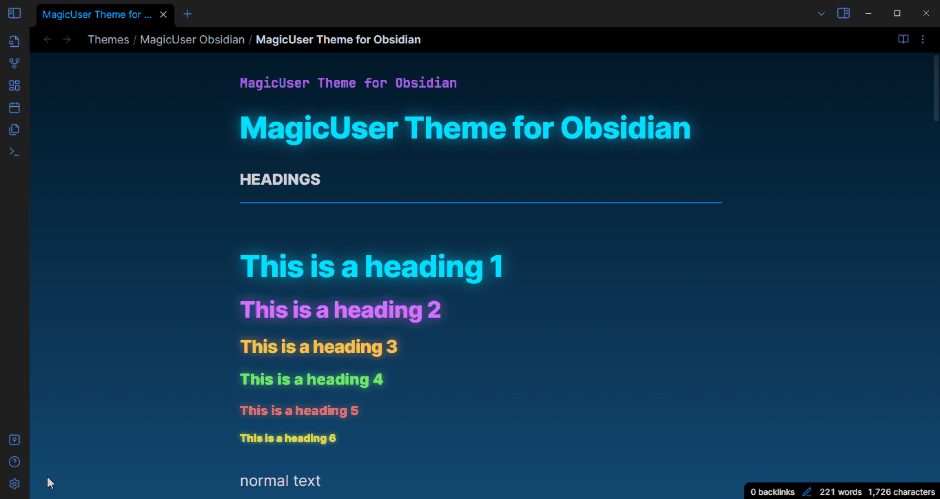

## Compact Prompts


## Style Settings - Customize Colors for Light and Dark Modes


## Custom Checkbox Icons


### Checkbox Icons (Extra 1)


### Checkbox Icons (Extra 2 and 3)


## Checkbox Shape


- **Checkbox shape**: **default** (rounded corners), **square** and **circle**.

Style Settings:
> Checklist -> Checkbox shape

## Additional Callouts

### Gallery Callouts


`> [!g-` + `color] Callout Title`

`> [!g-` + `color|number of columns] Callout Title`

*Number of columns*: 1 - 5

*Colors*: white, black, gray

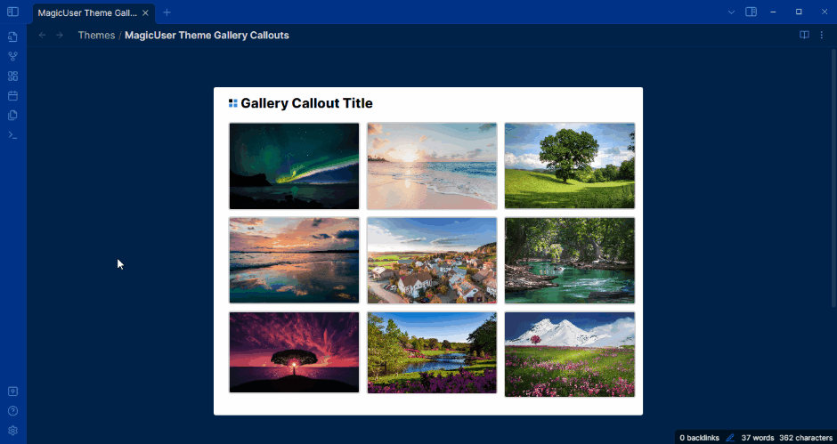

- Create image galleries. You can quickly organize and display your images in columns (1 to 5 columns). 

- Gallery callouts in **reading mode** are interactive. **Clicking and holding** any image thumbnail within a gallery callout triggers a lightbox effect. This immerses you in the image by gently dimming the background, allowing you to appreciate its details without distractions.

- **Number of columns**: The default callout option is 3 columns, if you don't add `|number` of columns. You can quickly change image gallery display by changing this number (**1** - **5** columns).

**Examples:**

**White background color - default (3 columns)**
```md
> [!g-white] Your Callout Title
> Place image 1 link (image 1)
> Place image 2 link (image 2)
> Place image n link (image n)

```

**Gray background color - 5 columns**
```md
> [!g-gray|5] Your Callout Title
> Place image 1 link (image 1)
> Place image 2 link (image 2)
> Place image n link (image n)

```

### Media Callouts

`> [!m-` + `color] Callout Title`

*Colors*: white, black, gray


### Table Callouts


`> [!table]`

You can add a table inside the table callout and adjust the table size/width according to the page.

`> [!table` + `|30% - 100%]` (percentage of the page occupied by the table)

- Values: **30%**, **40%**, **50%**, **60%**, **70%**, **80%**, **90%** and **100%**.
- You can also **center** the table (just add `center` after the percentage).
- Don't forget to leave an empty line before inserting the table.

Check it out the examples below.

**Default Table Callout**

```md
> [!table] Table 1
> 
> | Column 1  | Column 2 |  Column 3 |
> | :---:     | :---:    |  :---:    |
> | Text 1    | Text 2   | Text 3    |
> | Text 4    | Text 5   | Text 6    |
> | Text 7    | Text 8   | Text 9    |
```

**Table 70%**

```md
> [!table|70%] Table 1
> 
> | Column 1  | Column 2 |  Column 3 |
> | :---:     | :---:    |  :---:    |
> | Text 1    | Text 2   | Text 3    |
> | Text 4    | Text 5   | Text 6    |
> | Text 7    | Text 8   | Text 9    |
```

**Table 50% width and centered**
- add `percentage center`
  
```md
> [!table|50% center] Table 1
> 
> | Column 1  | Column 2 |  Column 3 |
> | :---:     | :---:    |  :---:    |
> | Text 1    | Text 2   | Text 3    |
> | Text 4    | Text 5   | Text 6    |
> | Text 7    | Text 8   | Text 9    |
```

### Highlighter Callouts

`> [!hl-` + `color] Your Callout Title`

*Colors*: green, blue, orange, yellow, red, pink, purple


### Pen Callouts

`> [!p-` + `color] Your Callout Title`

*Colors*: green, blue, orange, yellow, red, pink, purple


### Quote Callouts

`> [!q-` + `color] Quote`

*Colors*: green, blue, orange, yellow, red, pink, purple


### Box Callouts

`> [!b-` + `color] Your Callout Title`

*Colors*: green, blue, orange, yellow, red, pink, purple


### Untitled Box Callouts

`> [!ub-` + `color]`

*Colors*: green, blue, orange, yellow, red, pink, purple

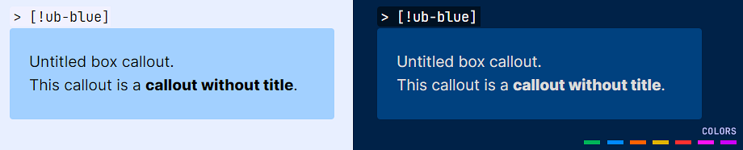

### Line Callouts

`> [!l-` + `color] Your Title`

*Colors*: green, blue, orange, yellow, red, pink, purple


Center the content by adding `|center` as shown below:

`> [l-`+ `color|center] Your callout title`

To align right, use `|right`.

### Line Box Callouts

`> [!lb-` + `color] Your Title`

*Colors*: green, blue, orange, yellow, red, pink, purple


### Callout Headings (H1 - H6)

`> [!h1 to h6-` + `color] Your Title`

*Colors*: green, blue, orange, yellow, red, pink, purple


Center the callout heading by adding `|center` as shown below:

`> [h1 to h6-` + `color|center] Your callout title`

To align right, use `|right`.

### Specific Callouts

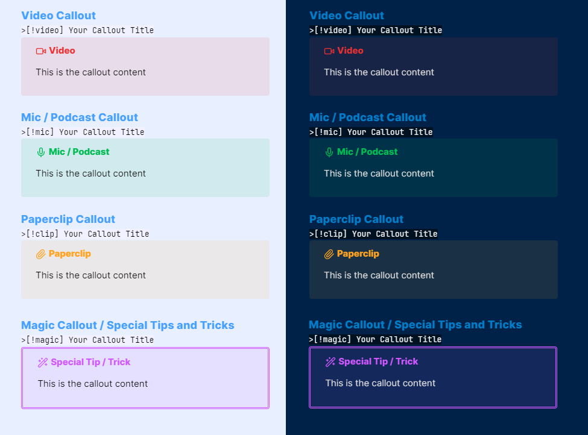


`> [!video]`

`> [!mic]`

`> [!clip]` or `> [!paperclip]`

`> [!book]`

`> [!comment]`

`> [!target]`

`> [!pro]` or `> [!pros]`

`> [!con]` or `> [!cons]`

`> [!link]` or `> [!links]`

`> [!magic]`

## Resize Callouts

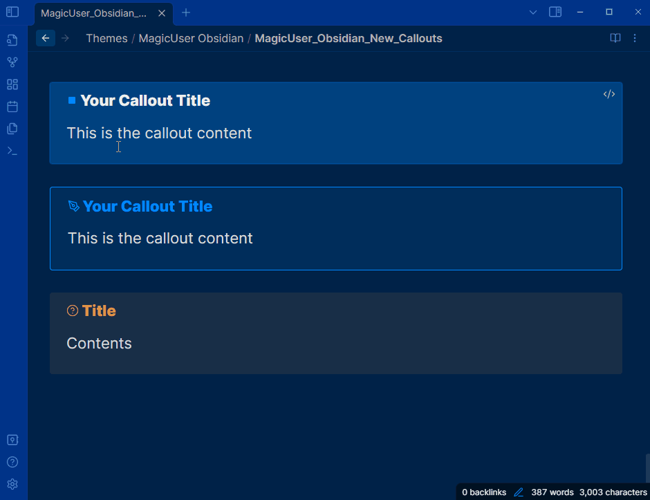

- **All callouts** can be resized. You can use the same syntax as table callouts in other callouts to resize them on screen (also center them).

`> [!callout-name|percentage]` or

`> [!callout-name|percentage center]`

``` md
> [!question|80% center] Your callout title
> Your callout content
```
- Values: **30%**, **40%**, **50%**, **60%**, **70%**, **80%**, **90%** and **100%**.
- You can also **center** the callout (just add `center` after the percentage)

## Caret Colors for Improved Visibility


## Caret Width (Selection and Multiple Cursors)


- When selecting text, the main edit cursor/caret will have a **different width** for better visibility (**no blinking caret**).
  
- Additional carets/cursors have a different width and no blinking carets (solid appearance).

## Active line background and border colors


- It works inside code samples and normal editor areas.
- Active line number will have the same color of the text cursor/caret.

## Search Highlight and Text Highlight

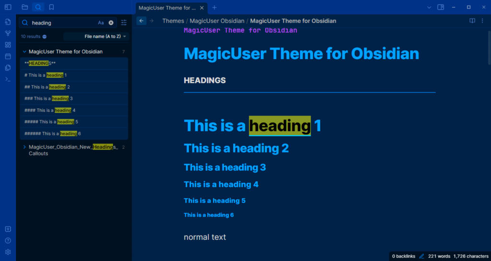

- **Global search highlight**, **linked mentions** and **outline text highlight**. 
- The search result text in **live preview**, **source** and **reading** modes will appear in black text color with highlighted background (default is **yellow**, but you can select any highlight color using the Style Settings).
- In **live preview** and **source** modes, the text will also appear **underlined** to be easier to find. It works for all types of text (normal text, bold, italic, links, tags, code and headings).

> [!NOTE]
> The underline will be the same color of your text cursor/caret color.

- **Outline highlight**: When you click on the item (using the outline) it will highlight the text the same way (search). I think it will be easier to read, especially when using different colors for H1-H6 titles (normal mode and neon mode).

## Search Highlight in Current Note


## Inline Comments


- **Inline interactive comments**. You can add inline comments to any part of your note, and when you hover over it, the content will be displayed in a box. The comment icon will be highlighted.

- You can add HTML bold `<b>`, italic `<i>`, links `<a href>`, `<u>`, `<mark>` tags in order to format your comments to make it easier to you to review them. 

- They were designed for quick comments 1 - 4 paragraphs.

- The inline comments **will not be printed or exported to PDF**.

**Syntax**:

1. Add the `<i>` tag with the class `muc` (**MagicUser Comment**)
2. Inside `<i class="muc">` just add a `<span>` tag with your comment. There is no need to add any class to the span tag.

**Example**

```html
This is the text of your note <i class="muc">
  <span>
    This is your first inline comment.
  </span>
</i>

```
- If you're used to HTML, just make it one line:

```html
This is the text of your note <i class="muc"><span>This is your inline comment.</span></i>

```

### Inline Comments Inside Tables

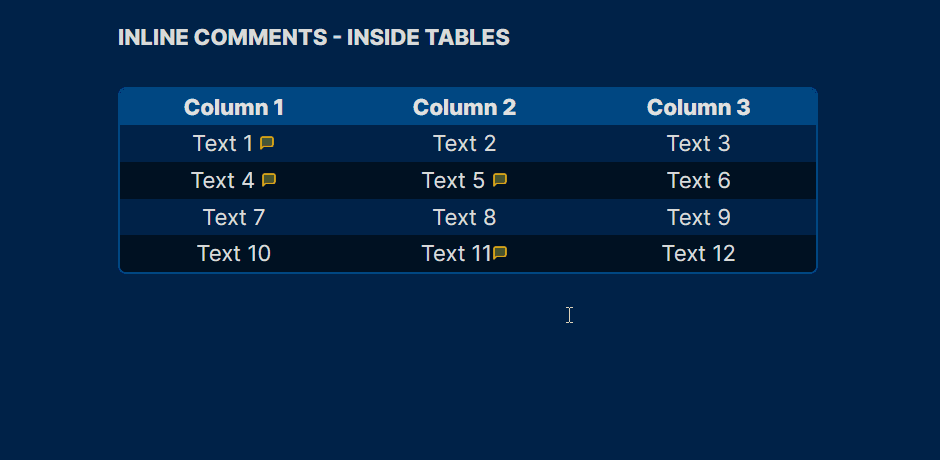


## Underlined Text Colors


The **default underline color** is **red**, but you can change it using the Style Settings plugin. You can also add 7 classes to make the text **underlined**. When you hover the underlined text it will become highlighted (underlined too). Please check the syntax below.

```html
Text <u>underlined text</u>.
```
The classes below can quickly change the color of the underline (just the color names): **blue**, **green**, **orange**, **yellow**, **red**, **purple** and **pink** (7 colors).

```html
Text <u>default underline</u>
Text <u class="blue">blue underline</u>.
Text <u class="green">green underline</u>.
Text <u class="yellow">yellow underline</u>.
Text <u class="orange">orange underline</u>.
Text <u class="red">red underline</u>.
Text <u class="purple">purple underline</u>.
Text <u class="pink">pink underline</u>.

```
> [!NOTE]
> The color of the text will remain the same, to avoid confusion with links.

## Hidden Text Underline


A) **Show text on hover** (hide text on live preview and reading modes)

Add the `hide` class to the `<u>` HTML tags.

```html
You can <u class="hide">hide</u> the text.
```

B) **Show text on click and hold** (hide text on live preview and reading modes)

Add the `hide-c` class to the `<u>` HTML tags (it will **reveal on click**).

```html
You can <u class="hide-c">hide</u> the text.
```

C) **Hide text on reading mode only - show on hover**

Add the `hide-r` class to the `<u>` HTML tags. It will **reveal on hover** (reading mode).

```html
You can <u class="hide-r">hide</u> the text.
```

D) **Hide text on reading mode only - show on click**

Add the `hide-rc` class to the `<u>` HTML tags. It will **reveal on click** (reading mode).

```html
You can <u class="hide-rc">hide</u> the text.
```

- The hidden text will appear on **hover** or on **click** (bolder and highlighted). You can change the **background (highlight)** and **foreground** color using the Style Settings options (different colors for light and dark modes).

E) **Hide on reading mode only - show on hover - full width**


- Add the `hide-w` class. It will hide the text on reading mode and occupy the full width of the parent element (table column) or page.

```html
Question: What is the name of this theme? <u class="hide-w">MagicUser</u>
```

## Highlighted Text Colors


```html
Text <mark>highlighted text</mark>
```

The default is **yellow**. But you can quickly change its color by adding the same 7 classes of the underlined text (just the color names). Please check it out below:

```html
Normal default mark <mark>default highlight</mark>.
Text <mark class="blue">blue highlight</mark>.
Text <mark class="green">green highlight</mark>.
Text <mark class="yellow">yellow highlight</mark>.
Text <mark class="orange">orange highlight</mark>.
Text <mark class="red">red highlight</mark>.
Text <mark class="purple">purple highlight</mark>.
Text <mark class="pink">pink highlight</mark>.

```

## Metadata highlighting


## Tables Layout

Default theme table layout:


- Improved table layout (**all preset themes** - light and dark modes). The colors of the tables will adapt to the different background colors of the preset themes.


- You can customize non-dataview tables using the **Tables submenu**.

- Independent table colors for light and dark modes, you can also select outer and inner border widths (sliders).


**Tables** submenu (Style Settings):
- **Preset tables**
- **Table body** text color
- **Table headers background** color
- **Table headers foreground** color
- **Table rows (odd)** background color
- **Table rows (even)** background color
- **Table row hover** background color
- **Outer table border** width
- **Inner table borders** width (rows and columns borders)
- **Disable table row hover**

> Table rounded corners (removed in theme version 19.2.0)

### Preset Tables


Style Settings: **Preset tables**
- `table1` (**column-striped table**)
- `table2`
- `table3`
- `table4` (with accent color)
- `table5` (with accent color)
- `table6` (with accent color)
- Default table (main theme table layout)
- **New**: **Numbered table** (rows and columns have numbers). You can customize the numbers background color.
- **New**: **Plain data** (simple layout for dataview tables)

Style Settings:
> **User Interface** -> **Tables** -> Preset tables


To achieve the desired table layout for specific notes, you can apply the above CSS classes (`table1` to `table6`).
> **Properties** -> **cssclasses** -> `table1` to `table6`

## Footnotes


- You can customize the color of the footnotes (Style Settings). The default color is orange (light/dark modes).

## Mermaid


## Code Theme (Light and Dark)


The syntax highlighting in this theme is similar to the MagicUser themes for VS Code (MagicUser and MagicUser Light Blue).

## Outline Code


- **Outline inline code** and **outline code block**: Add inline code and code block border color (independent outline). You can select independent colors for inline and code block elements (light and dark modes).
- You can toggle the outline inline code and outline code block using the command palette (or shortcut key).
- Select inline code border color.
- Select code block border color.

Style Settings:
> **Code** -> Outline code

## Mobile Display


## Plugins Compatibility


- **Style Settings**
- **Excalidraw**
- **Dataview**
- **Kanban**
- **Calendar**
- **Full Calendar**
- **Tasks**
- **Commander**
- **Banners**

## Why is it called MagicUser?

The name “**MagicUser**” for the themes I create has a deep meaning for me:

1. **Like a Magic User Class:** It references the concept of a “MagicUser” class in object-oriented programming languages. Similar to how a programmer uses a class to define objects. MagicUser class would be used to create magic users. Notably, “MagicUser” follows the common convention in many programming languages of writing class names in PascalCase, where the first letter of each word is capitalized.

2. **Personal Connection:** But there’s a deeper meaning! This resonates strongly with me because in the late 80s and 90s, I played a game series that had a huge impact on my life, called _Quest for Glory_ (originally known as _Hero’s Quest: So You Want to Be a Hero_). You could play as a fighter, a thief, or as a magic user/wizard. As you can guess, I played as the **magic user**.

    - In the second game, there was a quest where the player could strive to become a **Paladin**. The core values of the Paladin class resonated deeply with me. Still remember that board of quests, one of them was **“The Way of the Paladin: To seek. To learn. To do.”** Even though it was a game, the values became a guiding light for me, emphasizing seeking knowledge, continuous learning, and using that knowledge and your abilities to help others.

    - If you played the game and were good enough to become a Paladin, this only happened at the end of the second game (or during the third game).

While themes may come and go, hopefully, the underlying message will remain a constant.

Now you know the reasons why it’s called **MagicUser**.

## Feedback

Have suggestions for new features, usability improvements, or found a bug? Your feedback is appreciated! Submit an issue on GitHub and I'll do my best to respond as soon as possible. Every voice matters and helps shape the future of this theme. Thanks.

## License and Acknowledgements

MagicUser Theme for Obsidian

MIT License ⓒ Bernardo Pires

Most of the icons for the checkboxes and the quote icon were created by me (MIT License). You can find the comment in the embedded SVGs.

The icons used by the file icon, other callouts and some checkboxes icons are from [Lucide](https://lucide.dev/) Icons used by Obsidian. The Lucide icon library is licensed under the ISC License.

Some checkbox icons were inspired by the excellent Minimal Theme by Stephan Ango (@kepano) and the Things Theme by Colin Eckert (@colineckert). You can find more information about @kepano and @colineckert below, please check their themes and support their work:

- [Minimal Theme by Stephan Ango](https://github.com/kepano/obsidian-minimal)

- [Things Theme by Colin Eckert](https://github.com/colineckert/obsidian-things)


**Style Settings Community Plugin**

- Thanks to Matthew Meyers (@mgmeyers) for the amazing [Style Settings](https://github.com/mgmeyers/obsidian-style-settings) Plugin. Excellent work.


**Thanks for the Suggestions**

 I would like to express my gratitude to everyone who offered suggestions, tested each new feature, and provided invaluable feedback. Thanks to your attention to detail and constructive criticism, the theme has evolved into what it is today.

- @alitekdemir - suggestion to add the extra checkboxes (extra 1 - screenshot), based on Minimal and Things Themes. I hope you also find them useful.
- @YannMiro - suggestion to show/hide file icons.
- @zhouxinghong - reading mode suggestions (display H1-H6 labels on hover, colored H1-H6 labels) and colored indent guides in file explorer. Style Settings Theme Options (collapse indicator color). Rounded tables suggestion.
- @ll14m4n - dataview tables and stacked mode suggestions. Suggestion to change neon heading colors and links in headings (when neon mode is on).
- @golden234431 (Obsidian Forum) - inline title font size.
- @fred.joe3697 (Obsidian Forum) - underlined text color, hidden text underline and inline comments suggestions. Callouts without title suggestion. Preset tables suggestions, disable table row background change and table text color. Hover underline suggestion.
- @New (Obsidian Forum) - note width suggestion.
- @YonKuma (Obsidian Forum) - hide headings labels.
- @merlinuwe - scrollbars customization suggestion. Numbered tables suggestion. Colored indent guides for lists. Hide indent guides and suggestions (issue #62). Open in new window border.
- @indigofairyx - outline code and outline blockquote suggestion. Outline sidebars. Transparent menus blur effect. Tags suggestions.
- @Medullitus - panel divider hover color suggestion (Style Settings option). Suggestion to select the color of sidebar tags count number.
- @tr_mstein (Obsidian Forum) - independent outline code for inline code and code block.
- @damiankorcz - disable alternative checkboxes suggestion.
- @TineKolenik - hide tabs icons suggestion.

Special congratulations to the Obsidian.md team for creating a great software application.
