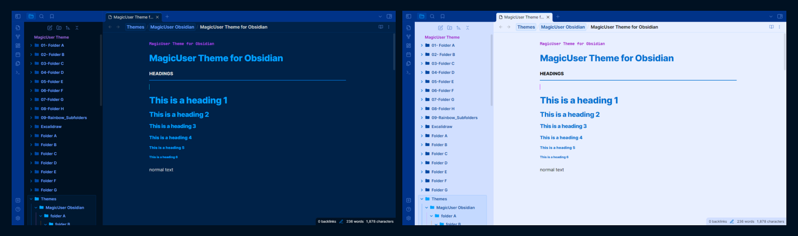
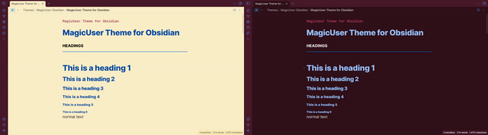

# ✨**MagicUser**✨ Theme


✨ **MagicUser** is a custom theme for Obsidian.md that provides a pleasant and focused note-taking experience, with light and dark themes for day and night use. 

With the **Style Settings** community plugin, customize a wide range of theme elements to suit your preferences and create a truly engaging and productive workspace.

## Installation

1. Open Obsidian **Settings** -> select **Appearance**

2. **Themes** -> click **Manage** -> search for **MagicUser**

3. Select the theme -> click **Install and use**

## Built-in Themes 



> No extra plugin required.

In order to activate the Translucent Dark and Translucent Light themes, turn on "**Translucent window**".

## Style Settings - Theme Options


> [Style Settings](https://github.com/mgmeyers/obsidian-style-settings) Community Plugin required.

<details>
<summary><b>Preset Themes</b> - <i>click to expand</i></summary>

1. **MagicUser** (Default)

2. **MagicUser Room Lamp**



3. **MagicUser Purple**


4. **MagicUser Teal**


5. **MagicUser Gray**
  


6. **MagicUser Camouflage**


7. **MagicUser Moon**


</details>

<details>
<summary><b>UI Settings</b> - <i>click to expand</i></summary>

Submenus:

◼ **Main Theme Colors**

- **Frame** color
- **Primary background** color
- **Secondary background** color
- **Caret** / **text cursor** color
- **Vault title** color
- **Inline title** color

◼ **Icons and Folders**

- **Folder name** color (light and dark modes)
- **Folder icon** color
- **File icon** color
- **Icon focused** color
- Show/hide **folder icons**
- Show/hide **file icons**

◼ **Indent Guides**

- Select 6 **indent guides colors** (independent colors for light and dark modes)

◼ **Line Highlight**

- Active **line highlight border** color (9 options)
- Active **line highlight background** color (9 options)

◼ **Reading Mode**

- **Reading indicators** (3 options: **left**, **left and right** and **no indicators**)
- **Reading indicators width** - slider controller
- **Reading indicators color**
- **H1-H6 label colors** (independent colors for light and dark modes)

◼ **UI Advanced Settings** (Desktop Version)


- Activate **distraction-free mode**
- Hide **sidebar buttons** (new note, new folder and others)
- Show/hide **tab navigation back and forward buttons**
- Auto hide **title bar top left buttons**
- Auto hide **top side buttons**
- Auto hide **bottom side buttons**
- Auto hide **status bar**

> When **auto hide** is turned on, UI elements will gradually appear when you move your mouse over the area where they would normally be, and then gradually disappear when you move your mouse away.

</details>

<details>
<summary><b>Headings H1-H6</b> - <i>click to expand</i></summary>

- Headings **font** (H1 - H6)
- H1 to H6 **font size**
- H1 to H6 **color**

</details>

<details>
<summary><b>Text</b> - <i>click to expand</i></summary>

- **Bold text** color
- **Italic text** color
- **Highlighted text** color

</details>

<details>
<summary><b>Links</b> - <i>click to expand</i></summary>

- **Internal link decoration** (underline, none)
- Internal link **color**
- Internal link **hover color**
- **External link decoration** (underline, none)
- External link **color**
- External Link **hover color**

</details>

<details>
<summary><b>Checklist</b> - <i>click to expand</i></summary>

- Checklist done **decoration** (underline, line-through, none)
- Checklist done **text color**

</details>

<details>
<summary><b>Code</b> - <i>click to expand</i></summary>

- Code font
- Code background color
- Keyword
- String
- Number
- Comment
- Function
- Property
- Tag
- Attribute
- Operator
- Punctuation

</details>

## Distraction-free Mode


To show the left ribbon, place your cursor on the left side of the screen, it will hide again when you move your cursor away from the left side of the screen.

- You can also auto hide the **status bar** (UI Advanced Settings).


- When you enable distraction-free mode with the Style Settings plugin, you can drag the window by the **tab title header** (the top bar with the file name and breadcrumb) or by the **right part of the status bar** (the lower right corner).

- *Style Settings*: You can add a **shortcut** to toggle distraction-free mode. You can also activate/deactivate distraction-free mode using the **command palette**.

## Style Settings - Customize Colors for Light and Dark Modes


## Folder Icons, File Icons and Colored Indent Guides


You can customize the **indent guides colors** using the *Style Settings* plugin (independent colors for light and dark modes). You can also show/hide folder and file icons.

## Folder and File Icons Colors


## Custom Checkbox Icons


### Checkbox Icons (Extra 1)


### Checkbox Icons (Extra 2 and 3)


## Additional Callouts

### Media Callouts


**Media callouts** are specially designed for **images** and **videos**. Available in three background colors.

`> [!m-` + `color] Callout Title`

**Colors**: white, black, gray

**Example**: *media callout gray*

```
> [!m-gray] Image or video title
> Add image or video here
> Image or video caption

```

### Highlighter Callouts


`> [!hl-` + `color] Your Callout Title`

**Colors**: green, blue, orange, yellow, red, pink, purple

**Example**: *highlighter blue callout*

```
> [!hl-blue] Your callout title here
> Callout text here

```

### Pen Callouts


`> [!p-` + `color] Your Callout Title`

**Colors**: green, blue, orange, yellow, red, pink, purple

**Example**: *pen blue callout*

```
> [!p-blue] Your callout title here
> Callout text here

```

### Quote Callouts


`> [!q-` + `color] Quote`

**Colors**: green, blue, orange, yellow, red, pink, purple

**Example**: *quote green callout*

```
> [!q-green] Quote
> Quote author or comment

```

### Box Callouts


`> [!b-` + `color] Your Callout Title`

**Colors**: green, blue, orange, yellow, red, pink, purple

**Example**: *box green callout*

```
> [!b-green] Your callout title here
> Callout text here

```

### Callout Headings (H1 - H6)


`> [!h1 to h6-` + `color] Your Title`

**Colors**: green, blue, orange, yellow, red, pink, purple

**Example**: *h1 green text callout*

```
> [!h1-green] Your h1 title here

```

### Specific Callouts


`> [!video]`

`> [!mic]`

`> [!clip]` or `> [!paperclip]`

`> [!book]`

`> [!comment]`

`> [!target]`

`> [!pro]` or `> [!pros]`

`> [!con]` or `> [!cons]`

`> [!link]` or `> [!links]`

`> [!magic]`

**Example**: *magic callout*

```
> [!magic] Special Tip
> Callout text here

```
## Caret Colors for Improved Visibility


## Caret Width (Selection and Multiple Cursors)


- When selecting text, the main edit cursor/caret will have a **different width** for better visibility (**no blinking caret**).
  
- Additional carets/cursors have a different width and no blinking carets (solid appearance).

## Search Highlight in Current Note


## Metadata highlighting


## Properties Layout


## Tables Layout


## Code Theme (Light and Dark)


The syntax highlighting in this theme is similar to the MagicUser themes for VS Code (MagicUser and MagicUser Light Blue).

## Mobile Display


## Feedback

Please share any issues or suggestions you have for improving the theme. I will do my best to respond quickly. Thank you for your feedback.

## License and Acknowledgements

MagicUser Theme for Obsidian

MIT License ⓒ Bernardo Pires

Most of the icons for the checkboxes and the quote icon were created by me (MIT License). You can find the comment in the embedded SVGs.

The icons used by the file icon, other callouts and some checkboxes icons are from [Lucide](https://lucide.dev/) Icons used by Obsidian. The Lucide icon library is licensed under the ISC License.

Some checkbox icons were inspired by the excellent Minimal Theme by Stephan Ango (@kepano) and the Things Theme by Colin Eckert (@colineckert). You can find more information about @kepano and @colineckert below, please check their themes and support their work:

- [Minimal Theme by Stephan Ango](https://github.com/kepano/obsidian-minimal)

- [Things Theme by Colin Eckert](https://github.com/colineckert/obsidian-things)


**Style Settings Community Plugin**

- Thanks to Matthew Meyers (@mgmeyers) for the amazing [Style Settings](https://github.com/mgmeyers/obsidian-style-settings) Plugin. Excellent work.


**Thanks for the Suggestions**
- @alitekdemir - suggestion to add the extra checkboxes (extra 1 - screenshot), based on Minimal and Things Themes. I hope you also find them useful.
- @YannMiro - suggestion to show/hide file icons.
- @zhouxinghong - reading mode suggestions (display H1-H6 labels on hover, colored H1-H6 labels) and colored indent guides in file explorer.

Special congratulations to the Obsidian.md team for creating a great software application.
