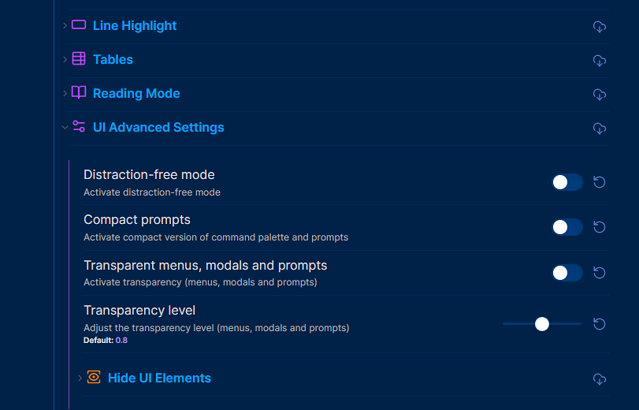
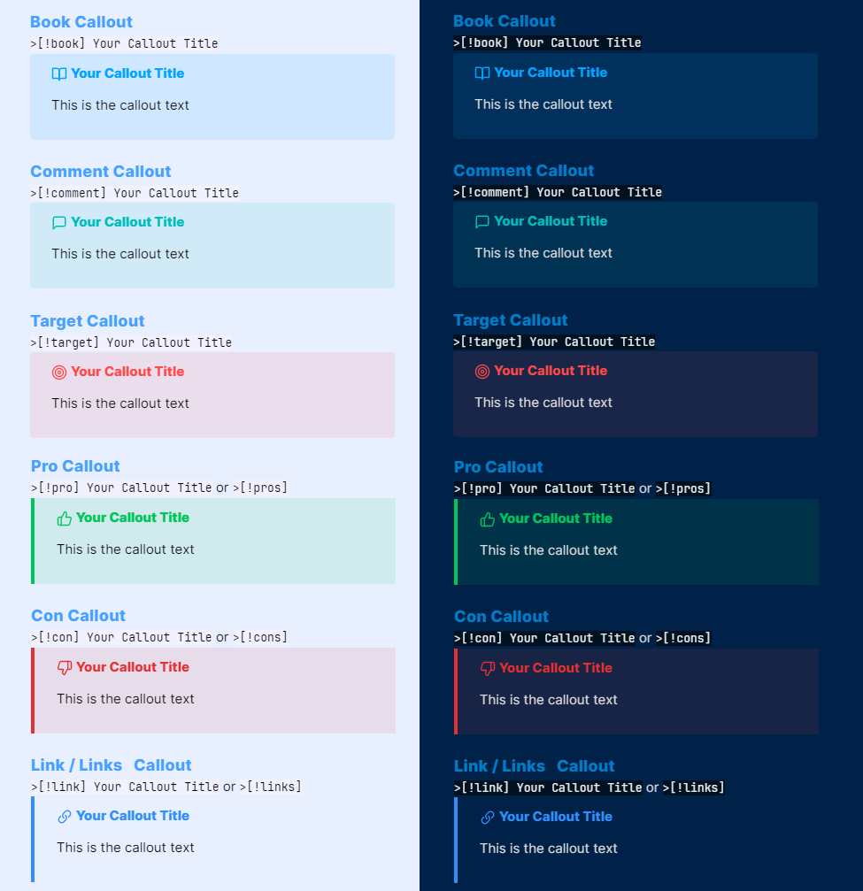
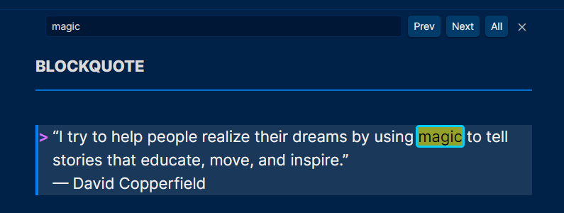

# ✨**MagicUser**✨ Theme


✨ **MagicUser** is a custom theme for Obsidian.md that provides a pleasant and focused note-taking experience, with light and dark themes for day and night use. 

With the Style Settings Community Plugin, you can customize many theme elements to create a personalized and productive workflow.

I hope you enjoy using MagicUser theme and find that it helps you to be more productive and inspired.

## Installation

1. Open Obsidian **Settings** -> select **Appearance**

2. **Themes** -> click **Manage** -> search for **MagicUser**

3. Select the theme -> click **Install and use**

## MagicUser Themes (4 Themes)


In order to activate the Translucent Dark and Translucent Light themes, turn on "**Translucent window**" (no extra plug-in required).

> Settings -> Appearance -> Advanced -> **Translucent window**

### Multiple Color Themes and Custom Colors with Style Settings Plugin


You can customize the following MagicUser theme elements ([Style Settings](https://github.com/mgmeyers/obsidian-style-settings) Community Plugin required):

**UI Settings** (UI Basic and Advanced Settings)

**UI Basic Settings**

- **Frame** Color
- **Primary Background** Color
- **Secondary Background** Color
- **Icon Focused** Color
- **Caret** / Text Cursor Color
- **Vault Title** Color
- **Inline Title** Color
- **Folder Name** Colors (light and dark modes)
- Show/Hide **Folder Icons**
- Active **Line Highlight Border** Color (9 options)
- Active **Line Highlight Background** Color (9 options)

**UI Advanced Settings** (Desktop Version)

- Activate **distraction-free mode**
- Hide **sidebar buttons** (new note, new folder and others)
- Show/hide **tab navigation back and forward buttons**
- Auto hide **title bar top left buttons**
- Auto hide **top side buttons**
- Auto hide **bottom side buttons**
- Auto hide **status bar**

**Headings H1-H6**

- Headings **Font** (H1 - H6)
- H1 to H6 **Font Size**
- H1 to H6 **Color**

**Text**

- **Bold Text** Color
- **Italic Text** Color
- **Highlighted Text** Color

**Links**

- **Internal Link Decoration** (underline, none)
- Internal Link Color
- Internal Link Hover Color
- **External Link Decoration** (underline, none)
- External Link Color
- External Link Hover Color

**CheckList**

- Checklist Done **Decoration** (underline, line-through, none)
- Checklist Done **Text Color**

## UI Advanced Settings



When **auto hide** is turned on, UI elements will gradually appear when you move your mouse over the area where they would normally be, and then gradually disappear when you move your mouse away.

## Distraction-free Mode


To show the left ribbon, place your cursor on the left side of the screen, it will hide again when you move your cursor away from the left side of the screen.

## Custom Checkbox Icons


### Checkbox Icons (Extra 1)


### Checkbox Icons (Extra 2 and 3)


## Additional Callouts

### Media Callouts


**Media callouts** are specially designed for **images** and **videos**. Available in three background colors.

`> [!m-` + `color] Callout Title`

**Colors**: white, black, gray

**Example**: *media callout gray*

```
> [!m-gray] Image or video title
> Add image or video here
> Image or video caption

```

### Highlighter Callouts


`> [!hl-` + `color] Your Callout Title`

**Colors**: green, blue, orange, yellow, red, pink, purple

**Example**: *highlighter blue callout*

```
> [!hl-blue] Your callout title here
> Callout text here

```

### Pen Callouts


`> [!p-` + `color] Your Callout Title`

**Colors**: green, blue, orange, yellow, red, pink, purple

**Example**: *pen blue callout*

```
> [!p-blue] Your callout title here
> Callout text here

```

### Quote Callouts


`> [!q-` + `color] Quote`

**Colors**: green, blue, orange, yellow, red, pink, purple

**Example**: *quote green callout*

```
> [!q-green] Quote
> Quote author or comment

```

### Box Callouts


`> [!b-` + `color] Your Callout Title`

**Colors**: green, blue, orange, yellow, red, pink, purple

**Example**: *box green callout*

```
> [!b-green] Your callout title here
> Callout text here

```

### Callout Headings (H1 - H6)


`> [!h1 to h6-` + `color] Your Title`

**Colors**: green, blue, orange, yellow, red, pink, purple

**Example**: *h1 green text callout*

```
> [!h1-green] Your h1 title here

```

### Specific Callouts




`> [!video]`

`> [!mic]`

`> [!clip]` or `> [!paperclip]`

`> [!book]`

`> [!comment]`

`> [!target]`

`> [!pro]` or `> [!pros]`

`> [!con]` or `> [!cons]`

`> [!link]` or `> [!links]`

`> [!magic]`

**Example**: *magic callout*

```
> [!magic] Special Tip
> Callout text here

```

## Folders and Notes Icons


## Caret Colors for Improved Visibility


## Caret Width (Selection and Multiple Cursors)


- When selecting text, the main edit cursor/caret will have a **different width** for better visibility (**no blinking caret**).
  
- Additional carets/cursors have a different width and no blinking carets (solid appearance).

## Search Highlight in Current Note



## Properties Layout


## Tables Layout


```Markdown
| Column 1  | Column 2 |  Column 3 |
| :---:     | :---:    |  :---:    |
| Text 1    | Text 2   | Text 3    |
| Text 4    | Text 5   | Text 6    |
| Text 7    | Text 8   | Text 9    |
| Text 10   | Text 11  | Text 12   |

```

## Code Theme (Light and Dark)


The syntax highlighting in this theme is similar to the MagicUser themes for VS Code (MagicUser and MagicUser Light Blue).

## Mobile Display


## Feedback

Please share any issues or suggestions you have for improving the theme. I will do my best to respond quickly. Thank you for your feedback.

## License and Acknowledgements

MagicUser Theme for Obsidian

MIT License ⓒ Bernardo Pires

Most of the icons for the checkboxes and the quote icon were created by me (MIT License). You can find the comment in the embedded SVGs.

The icons used by the file icon, other callouts and some checkboxes icons are from [Lucide](https://lucide.dev/) Icons used by Obsidian. The Lucide icon library is licensed under the ISC License.

Some checkbox icons were inspired by the excellent Minimal Theme by Stephan Ango (@kepano) and the Things Theme by Colin Eckert (@colineckert). You can find more information about @kepano and @colineckert below, please check their themes and support their work:

- [Minimal Theme by Stephan Ango](https://github.com/kepano/obsidian-minimal)

- [Things Theme by Colin Eckert](https://github.com/colineckert/obsidian-things)

**Thanks for the Suggestions**
- Thanks to @alitekdemir for the suggestion to add the extra checkboxes (extra 1 - screenshot), based on Minimal and Things Themes. I hope you also find them useful.

Special congratulations to the Obsidian.md team for creating a great software application.
