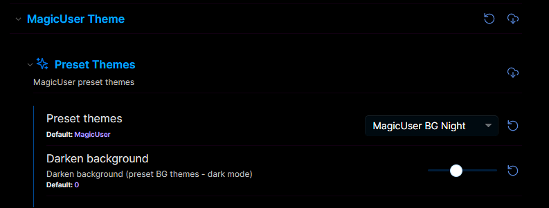
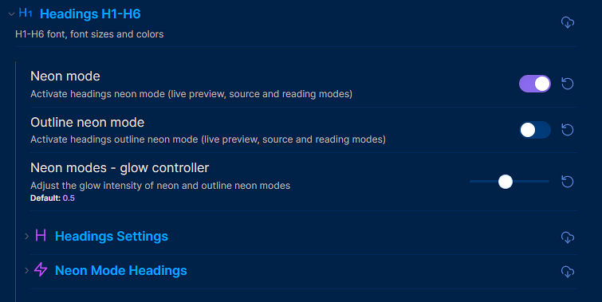
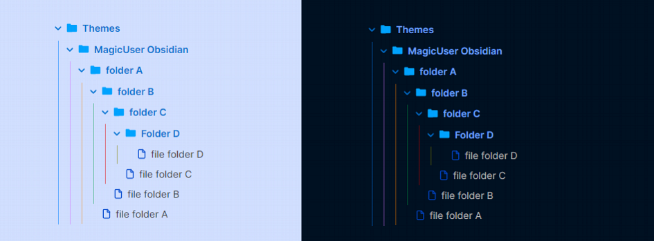
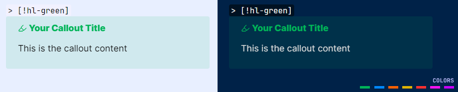
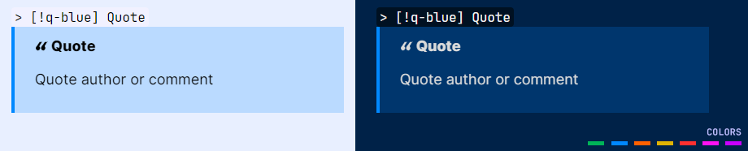
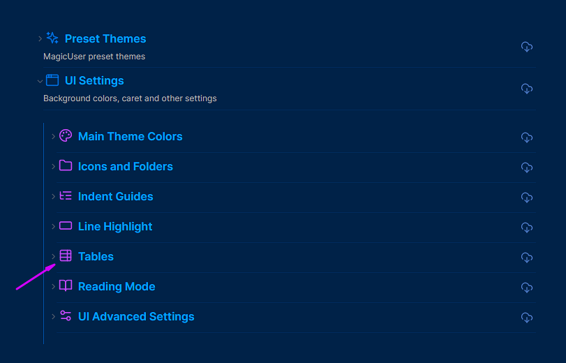

# ✨**MagicUser**✨ Theme


✨ **MagicUser** is a custom theme for Obsidian.md that provides a pleasant and focused note-taking experience, with light and dark themes for day and night use. 

With the **Style Settings** community plugin, customize a wide range of theme elements to suit your preferences and create a truly engaging and productive workspace.

## Installation

1. Open Obsidian **Settings** -> select **Appearance**

2. **Themes** -> click **Manage** -> search for **MagicUser**

3. Select the theme -> click **Install and use**

## Built-in Themes 


> No extra plugin required.

In order to activate the Translucent Dark and Translucent Light themes, turn on "**Translucent window**".

## Plugins Compatibility


- **Style Settings**
- **Excalidraw**
- **Dataview**
- **Kanban**
- **Calendar**
- **Full Calendar**
- **Tasks**

## Style Settings - Theme Options


> [Style Settings](https://github.com/mgmeyers/obsidian-style-settings) Community Plugin required.

<details open="open">
<summary><b>Preset Themes</b> - <i>click to expand/collapse</i></summary>

1. **MagicUser** (Default)

2. **MagicUser Room Lamp**


3. **MagicUser Purple**


4. **MagicUser Teal**


5. **MagicUser Gray**
  


6. **MagicUser Camouflage**


7. **MagicUser Moon**


8. **MagicUser Teacher**


9. **MagicUser Creativity**


10. **MagicUser Concentration**


**MagicUser BG Themes**


**MagicUser BG Themes (Light Themes)**




- **Darken background** slider (**all preset BG themes** - **dark mode**). You can darken the background of all preset BG themes to improve readability.

</details>

<details>
<summary><b>UI Settings</b> - <i>click to expand</i></summary>

Submenus:

◼ **Main Theme Colors**

- **Frame** color
- **Primary background** color
- **Secondary background** color
- **Caret** / **text cursor** color
- **Vault title** color
- **Inline title** color
- **Inline title** font size
- Stacked mode tabs: active tab **border color**
- Stacked mode tabs: active tab **border width**

◼ **Icons and Folders**

- **Folder name** color (light and dark modes)
- **Folder icon** color
- **File icon** color
- **Icon focused** color
- Show/hide **folder icons**
- Show/hide **file icons**

◼ **Indent Guides**

- Select 6 **indent guides colors** (independent colors for light and dark modes)

◼ **Line Highlight**

- Active **line highlight border** color (9 options)
- Active **line highlight background** color (9 options)

◼ **Tables**

- **Table headers background** color
- **Table headers foreground** color
- **Table rows (odd)** background color
- **Table rows (even)** background color
- **Table row hover** background color
- **Outer table border** width
- **Inner table borders** width (rows and columns borders)
- **Table rounded corners** (0 = square corners)

◼ **Reading Mode**

- **Reading indicator width** - slider controller
- **Reading indicator color**
- **H1-H6 label colors** (independent colors for light and dark modes)

◼ **UI Advanced Settings** (Desktop Version)


- **Warm screen mode** (slider)
- Activate **distraction-free mode**
- **Compact command palette and prompts** (toggle)
- **Transparent menus** and **prompts** (toggle)
- **Transparency level adjustment** (slider).

**Hide UI Elements** submenu:
- Hide **sidebar buttons** (new note, new folder and others)
- Show/hide **tab navigation back and forward buttons**
- Auto hide **title bar top left buttons**
- Auto hide **top side buttons**
- Auto hide **bottom side buttons**
- Auto hide **status bar**

> When **auto hide** is turned on, UI elements will gradually appear when you move your mouse over the area where they would normally be, and then gradually disappear when you move your mouse away.

</details>

<details>
<summary><b>Headings H1-H6</b> - <i>click to expand</i></summary>

- Neon Mode
- Outline Neon Mode
- Neon glow controller

**Headings Settings** submenu

- Headings **font** (H1 - H6)
- H1 to H6 **font size**
- H1 to H6 **color**

**Neon Mode Headings** submenu

- H1 to H6 neon mode colors
  
</details>

<details>
<summary><b>Text</b> - <i>click to expand</i></summary>

- **Bold text** color
- **Italic text** color
- **Highlighted text** color
- **Underline text** color
- **Footnotes** color

</details>

<details>
<summary><b>Links</b> - <i>click to expand</i></summary>

- **Internal link decoration** (underline, none)
- Internal link **color**
- Internal link **hover color**
- **External link decoration** (underline, none)
- External link **color**
- External Link **hover color**

</details>

<details>
<summary><b>Checklist</b> - <i>click to expand</i></summary>

- Checklist done **decoration** (underline, line-through, none)
- Checklist done **text color**

</details>

<details>
<summary><b>Code</b> - <i>click to expand</i></summary>

- Code font
- Code background color
- Keyword
- String
- Number
- Comment
- Function
- Property
- Tag
- Attribute
- Operator
- Punctuation

</details>

## Rainbow Folders


- When activated, this mode will highlight the background of folders starting with the numbers "01-" and/or "001-" to "08-" and/or "008" (according to the order of rainbow colors plus the gray color, 8th color). It will work with folders starting with "01 Folder name" to "08 Folder name".
- All **subfolders** will have the same color of the top folder.

**Folder name**:

`Number` + ` ` (space) and/or 
`Number` + `-` (hyphen or minus)

**Example**:
`01 Folder name` or `01-Folder name`

Activate this mode using the Style Settings plugin:
> **UI Settings** -> **Icons and Folders** -> Rainbow colored background folders 

## Dark Sidebar (Light Mode)


- Style Settings: Enable dark sidebar in light mode (compatible with preset themes)

> **Style Settings** -> **UI Settings** -> **Main Theme Colors** -> Dark sidebar (light mode)
 


## Neon Mode


> **Style Settings** -> **Headings H1-H6** -> Neon mode


## Neon Mode Custom Headings Colors


You can customize the neon mode headings colors using the **Neon Mode Headings** submenu.

> Headings H1-H6 -> Neon Mode Headings



## Neon Mode Glow Controller


## Outline Neon Mode


**Outline Neon** mode enlarges headings for effortless reading, all while keeping your text neon-highlighted. Choose your preferred style.

## Warm Screen Mode


> UI Settings -> UI Advanced Settings -> **Warm screen mode**

- Instead of just dimming the screen, the **warm scren mode** adjusts the light spectrum towards warmer tones (red, orange, yellow) and reduces cooler tones (e.g. blue). 
- Warmer tones are considered less harsh on the eyes, especially in **low-light environments** or extended use.
- The warm screen mode can create a more relaxing and soothing atmosphere for reading, working, or viewing media.
- If you embed PDFs, you will be able to read them with warmer screen color.


- You can adjust the **warm screen mode intensity** (using the slider).
- To turn it off, set the slider to zero (default option).

## Distraction-free Mode


To show the left ribbon, place your cursor on the left side of the screen, it will hide again when you move your cursor away from the left side of the screen.

- You can also auto hide the **status bar** (UI Advanced Settings).


## Reading Mode: Reading Glow Effect and Reading Indicator


- Reading Mode: **Reading glow** effect.
- Style Settings: Reading glow **color** (7 colors).
- Style Settings: Reading glow border size.
- Style Settings: Reading glow corners size (0 = square corners).

## Dataview Tables to Cards


- **Dataview tables can be converted to cards**. Add cssclasses property (with `cards` class) on the note you want to transform the dataview tables to cards. This cards class was inspired by @kepano excellent Minimal theme, but it is a different code and look. I hope you also find it useful.

- The default `cards` class will add **3 columns** maximum. If you want just 2 columns add `cards cards2` (cssclasses property).

```frontmatter
---
# Display table to cards (2 columns)
cssclasses:
  - cards
  - cards2
---
```

- You can add **5 additional classes**: `cards1`, `cards2`, `cards3`, `cards4` and `cards5` (corresponding to the number of columns - 1 to 5 columns). I think this is easy to remember and implement.

```frontmatter
---
# Display table to cards (5 columns)
cssclasses:
  - cards
  - cards5
---
```

## Transparent Menus, Modals and Prompts


## Compact Prompts


## Style Settings - Customize Colors for Light and Dark Modes


## Folder Icons, File Icons and Colored Indent Guides



You can customize the **indent guides colors** using the Style Settings plugin (independent colors for light and dark modes). You can also show/hide **folder icons** and **file icons**.

## Sidebar Open Folder Area


- Style Settings: select sidebar open folder area **border color**.
- Style Settings: select sidebar open folder area **background color**.
- Style Settings: **hide** sidebar open folder area.

## Custom Checkbox Icons


### Checkbox Icons (Extra 1)


### Checkbox Icons (Extra 2 and 3)


## Additional Callouts

### Gallery Callouts


`> [!g-` + `color] Callout Title`

`> [!g-` + `color|number of columns] Callout Title`

*Number of columns*: 1 - 5

*Colors*: white, black, gray


- Create image galleries. You can quickly organize and display your images in columns (1 to 5 columns). 

- Gallery callouts in **reading mode** are interactive. **Clicking and holding** any image thumbnail within a gallery callout triggers a lightbox effect. This immerses you in the image by gently dimming the background, allowing you to appreciate its details without distractions.

- **Number of columns**: The default callout option is 3 columns, if you don't add `|number` of columns. You can quickly change image gallery display by changing this number (**1** - **5** columns).

**Examples:**

**White background color - default (3 columns)**
```md
> [!g-white] Your Callout Title
> Place image 1 link (image 1)
> Place image 2 link (image 2)
> Place image n link (image n)

```

**Gray background color - 5 columns**
```md
> [!g-gray|5] Your Callout Title
> Place image 1 link (image 1)
> Place image 2 link (image 2)
> Place image n link (image n)

```

### Media Callouts

`> [!m-` + `color] Callout Title`

*Colors*: white, black, gray


### Highlighter Callouts

`> [!hl-` + `color] Your Callout Title`

*Colors*: green, blue, orange, yellow, red, pink, purple



### Pen Callouts

`> [!p-` + `color] Your Callout Title`

*Colors*: green, blue, orange, yellow, red, pink, purple


### Quote Callouts

`> [!q-` + `color] Quote`

*Colors*: green, blue, orange, yellow, red, pink, purple



### Box Callouts

`> [!b-` + `color] Your Callout Title`

*Colors*: green, blue, orange, yellow, red, pink, purple


### Line Callouts

`> [!l-` + `color] Your Title`

*Colors*: green, blue, orange, yellow, red, pink, purple


Center the content by adding `|center` as shown below:

`> [l-`+ `color|center] Your callout title`

To align right, use `|right`.

### Line Box Callouts

`> [!lb-` + `color] Your Title`

*Colors*: green, blue, orange, yellow, red, pink, purple


### Callout Headings (H1 - H6)

`> [!h1 to h6-` + `color] Your Title`

*Colors*: green, blue, orange, yellow, red, pink, purple


Center the callout heading by adding `|center` as shown below:

`> [h1 to h6-` + `color|center] Your callout title`

To align right, use `|right`.

### Specific Callouts


`> [!video]`

`> [!mic]`

`> [!clip]` or `> [!paperclip]`

`> [!book]`

`> [!comment]`

`> [!target]`

`> [!pro]` or `> [!pros]`

`> [!con]` or `> [!cons]`

`> [!link]` or `> [!links]`

`> [!magic]`

## Caret Colors for Improved Visibility


## Caret Width (Selection and Multiple Cursors)


- When selecting text, the main edit cursor/caret will have a **different width** for better visibility (**no blinking caret**).
  
- Additional carets/cursors have a different width and no blinking carets (solid appearance).

## Active line background and border colors


- It works inside code samples and normal editor areas.
- Active line number will have the same color of the text cursor/caret.

## Search Highlight and Text Highlight


- **Global search highlight**, **linked mentions** and **outline text highlight**. 
- The search result text in **live preview**, **source** and **reading** modes will appear in black text color with highlighted background (default is **yellow**, but you can select any highlight color using the Style Settings). In **live preview** and **source** modes, the text will also appear **underlined** to be easier to find. It works for all types of text (normal text, bold, italic, links, tags, code and headings).

> Note: The underline will be the same color of your text cursor/caret color.

- **Outline highlight**: When you click on the item (using the outline) it will highlight the text the same way (search). I think it will be easier to read, especially when using different colors for H1-H6 titles (normal mode and neon mode).

## Search Highlight in Current Note


## Underlined Text Colors


The **default underline color** is **red**, but you can change it using the Style Settings plugin. You can also add 7 classes to make the text **underlined**. When you hover the underlined text it will become highlighted (underlined too). Please check the syntax below.

```html
Text <u>underlined text</u>.
```
The classes below can quickly change the color of the underline (just the color names): **blue**, **green**, **orange**, **yellow**, **red**, **purple** and **pink** (7 colors).

```html
Text <u>default underline</u>
Text <u class="blue">blue underline</u>.
Text <u class="green">green underline</u>.
Text <u class="yellow">yellow underline</u>.
Text <u class="orange">orange underline</u>.
Text <u class="red">red underline</u>.
Text <u class="purple">purple underline</u>.
Text <u class="pink">pink underline</u>.

```

> **Note**: The color of the text will remain the same, to avoid confusion with links.

## Hidden Text Underline


A) **Show text on hover** (hide text on live preview and reading modes)

It works using the classes `hidden` and/or `hide` to html `<u>` tags.

```html
Text is <u class="hidden">hidden</u>.

You can also <u class="hide">hide</u> the text.
```

B) **Show text on click and hold** (hide text on live preview and reading modes)

It works using the classes `hidden-c` and/or `hide-c` to html `<u>` tags. Just add `-c` to the class name (it will **reveal on click**)

```html
Text is <u class="hidden-c">hidden</u>.

You can also <u class="hide-c">hide</u> the text.
```

C) **Hide text on reading mode only - show on hover**

It works using the classes `hidden-r` and/or `hide-r` to html `<u>` tags. It will **reveal on hover** (reading mode).

```html
Text is <u class="hidden-r">hidden</u>.

You can also <u class="hide-r">hide</u> the text.
```

D) **Hide text on reading mode only - show on click**

It works using the classes `hidden-rc` and/or `hide-rc` to html `<u>` tags. It will **reveal on click** (reading mode).

```html
Text is <u class="hidden-rc">hidden</u>.

You can also <u class="hide-rc">hide</u> the text.
```

- The hidden text will appear on **hover** or on **click** (bolder and highlighted). You can change the highlight color using the Style Settings option.

## Highlighted Text Colors


```html
Text <mark>highlighted text</mark>
```

The default is **yellow**. But you can quickly change its color by adding the same 7 classes of the underlined text (just the color names). Please check it out below:

```html
Normal default mark <mark>default highlight</mark>.
Text <mark class="blue">blue highlight</mark>.
Text <mark class="green">green highlight</mark>.
Text <mark class="yellow">yellow highlight</mark>.
Text <mark class="orange">orange highlight</mark>.
Text <mark class="red">red highlight</mark>.
Text <mark class="purple">purple highlight</mark>.
Text <mark class="pink">pink highlight</mark>.

```

## Metadata highlighting


## Properties Layout


## Tables Layout

Default theme table layout:


- Improved table layout (**all preset themes** - light and dark modes). The colors of the tables will adapt to the different background colors of the preset themes.


- Normal tables (non-dataview tables) will have **rounded corners** by default. You can customize non-dataview tables using the **Tables submenu**.



- Independent table colors for light and dark modes, you can also select outer and inner border widths (sliders).


**Tables** submenu (Style Settings):
- **Table headers background** color
- **Table headers foreground** color
- **Table rows (odd)** background color
- **Table rows (even)** background color
- **Table row hover** background color
- **Outer table border** width
- **Inner table borders** width (rows and columns borders)
- **Table rounded corners** (0 = **square corners**)

## Code Theme (Light and Dark)


The syntax highlighting in this theme is similar to the MagicUser themes for VS Code (MagicUser and MagicUser Light Blue).

## Footnotes


- You can customize the color of the footnotes (Style Settings). The default color is orange (light/dark modes).

## Mermaid


## Math


## Mobile Display


## Feedback

Have suggestions for new features, usability improvements, or found a bug? Your feedback is appreciated! Submit an issue on GitHub and I'll do my best to respond as soon as possible. Every voice matters and helps shape the future of this theme. Thanks!

## License and Acknowledgements

MagicUser Theme for Obsidian

MIT License ⓒ Bernardo Pires

Most of the icons for the checkboxes and the quote icon were created by me (MIT License). You can find the comment in the embedded SVGs.

The icons used by the file icon, other callouts and some checkboxes icons are from [Lucide](https://lucide.dev/) Icons used by Obsidian. The Lucide icon library is licensed under the ISC License.

Some checkbox icons were inspired by the excellent Minimal Theme by Stephan Ango (@kepano) and the Things Theme by Colin Eckert (@colineckert). You can find more information about @kepano and @colineckert below, please check their themes and support their work:

- [Minimal Theme by Stephan Ango](https://github.com/kepano/obsidian-minimal)

- [Things Theme by Colin Eckert](https://github.com/colineckert/obsidian-things)


**Style Settings Community Plugin**

- Thanks to Matthew Meyers (@mgmeyers) for the amazing [Style Settings](https://github.com/mgmeyers/obsidian-style-settings) Plugin. Excellent work.


**Thanks for the Suggestions**
- @alitekdemir - suggestion to add the extra checkboxes (extra 1 - screenshot), based on Minimal and Things Themes. I hope you also find them useful.
- @YannMiro - suggestion to show/hide file icons.
- @zhouxinghong - reading mode suggestions (display H1-H6 labels on hover, colored H1-H6 labels) and colored indent guides in file explorer. Rounded tables suggestion.
- @ll14m4n - dataview tables and stacked mode suggestions. Suggestion to change neon heading colors and links in headings (when neon mode is on).
- @golden234431 (Obsidian Forum) - inline title font size.
- @fred.joe3697 (Obsidian Forum) - underlined text color. Hidden text underline suggestion.

Special congratulations to the Obsidian.md team for creating a great software application.
