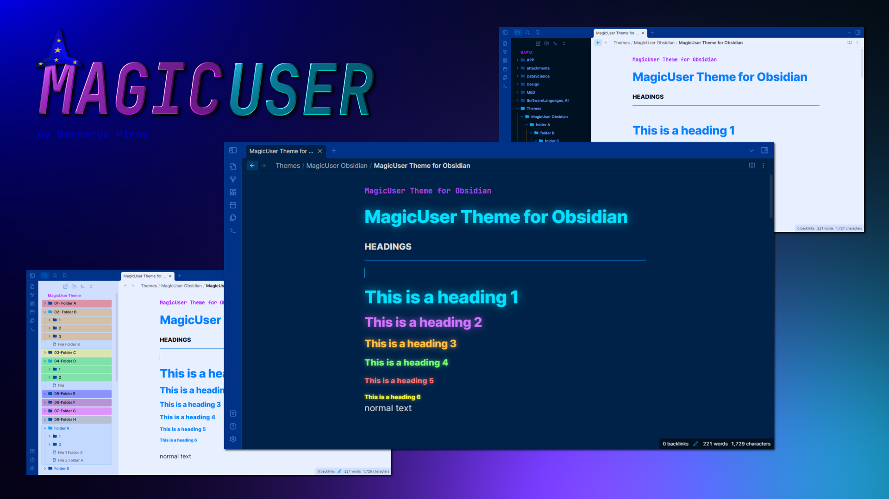
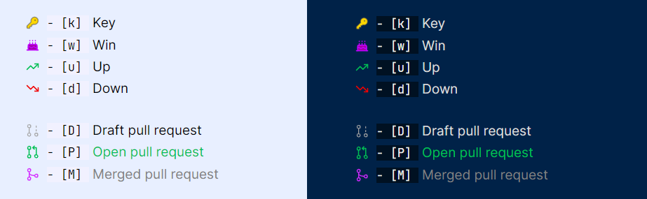
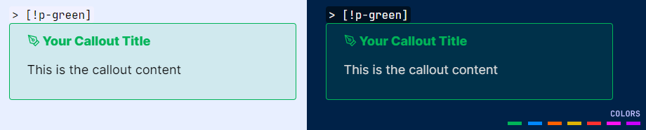
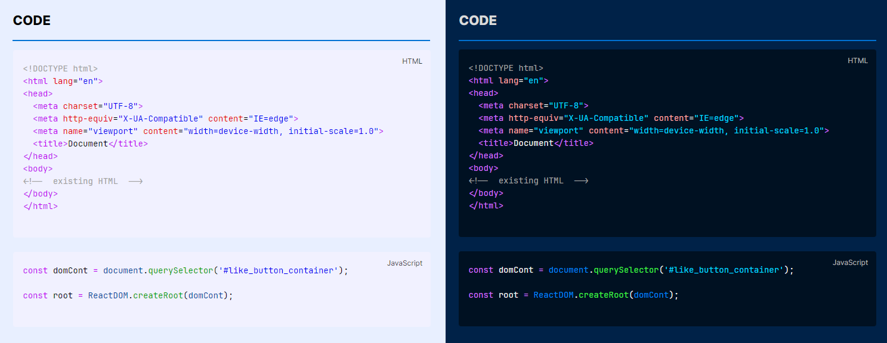

# ✨**MagicUser**✨ Theme



✨ **MagicUser** is a custom theme for Obsidian.md aiming to create a pleasant environment for note-taking activities with greater focus and concentration. It has 2 **light themes** and 2 **dark themes** for day/night use.

I hope this theme helps to increase your productivity and inspiration.

## Installation

1. Open Obsidian **Settings** -> select **Appearance**

2. **Themes** -> click **Manage** -> search for **MagicUser**

3. Select the theme -> click **Install and use**

## MagicUser Themes (4 Themes)


In order to activate the Translucent Dark and Translucent Light themes, turn on "**Translucent window**" (no extra plug-in required).

> **Settings** -> **Appearance** -> **Advanced** -> **Translucent window**

## Custom Checkbox Icons


#### Checkbox Icons (Extra 1)



#### Checkbox Icons (Extra 2 and 3)


## Additional Callouts

### Highlighter Callouts


`> [!hl-` + `color] Your Callout Title`

**Colors**: green, blue, orange, yellow, red, pink, purple

**Example**: *highlighter blue callout*

```
> [!hl-blue] Your callout title here
> Callout text here

```


### Pen Callouts



`> [!p-` + `color] Your Callout Title`

**Colors**: green, blue, orange, yellow, red, pink, purple

**Example**: *pen blue callout*

```
> [!p-blue] Your callout title here
> Callout text here

```

### Quote Callouts


`> [!q-` + `color] Quote`

**Colors**: green, blue, orange, yellow, red, pink, purple

**Example**: *quote green callout*

```
> [!q-green] Quote
> Quote author or comment

```

### Box Callouts


`> [!b-` + `color] Your Callout Title`

**Colors**: green, blue, orange, yellow, red, pink, purple

**Example**: *box green callout*

```
> [!b-green] Your callout title here
> Callout text here

```

### Callout Headings (H1 - H6)


`> [!h1 to h6-` + `color] Your Title`

**Colors**: green, blue, orange, yellow, red, pink, purple

**Example**: *h1 green text callout*

```
> [!h1-green] Your h1 title here

```

### Specific Callouts


`> [!video]`

`> [!mic]`

`> [!clip]` or `> [!paperclip]`

`> [!book]`

`> [!comment]`

`> [!target]`

`> [!pro]` or `> [!pros]`

`> [!con]` or `> [!cons]`

`> [!link]` or `> [!links]`

`> [!magic]`

**Example**: *magic callout*

```
> [!magic] Special Tip
> Callout text here

```
 
## Folders and Notes Icons


## Caret Colors for Improved Visibility


## Caret Width (Selection and Multiple Cursors)


- When selecting text, the main edit cursor/caret will have a **different width** for better visibility (**no blinking caret**).
  
- Additional carets/cursors have a different width and no blinking carets (solid appearance).

## Search Highlight in Current Note


## Properties Layout


## Tables Layout


```Markdown
| Column 1  | Column 2 |  Column 3 |
| :---:     | :---:    |  :---:    |
| Text 1    | Text 2   | Text 3    |
| Text 4    | Text 5   | Text 6    |
| Text 7    | Text 8   | Text 9    |
| Text 10   | Text 11  | Text 12   |

```

## Code Theme (Light and Dark)



The syntax highlighting is similar to the MagicUser themes for VS Code (MagicUser and MagicUser Light Blue for VS Code).

## Mobile Display


## Feedback
  
If you have any issues and/or suggestions, please submit an issue. I will try to answer as soon as possible. Thanks.

## License and Acknowledgements

MagicUser Theme for Obsidian

MIT License ⓒ Bernardo Pires

Most of the icons for the checkboxes and the quote icon were created by me (MIT License). You can find the comment in the embedded SVGs.

The icons used by the file icon, other callouts and some checkboxes icons are from [Lucide](https://lucide.dev/) Icons used by Obsidian. The Lucide icon library is licensed under the ISC License.

Some checkbox icons were inspired by the excellent Minimal Theme by Stephan Ango (@kepano) and the Things Theme by Colin Eckert (@colineckert). You can find more information about @kepano and @colineckert below, please check their themes and support their work:

- [Minimal Theme by Stephan Ango](https://github.com/kepano/obsidian-minimal)

- [Things Theme by Colin Eckert](https://github.com/colineckert/obsidian-things)

**Thanks for the Suggestions**
- Thanks to @alitekdemir for the suggestion to add the extra checkboxes (extra 1 - screenshot), based on Minimal and Things Themes. I hope you also find them useful.

Special congratulations to the Obsidian.md team for creating a great software application.
